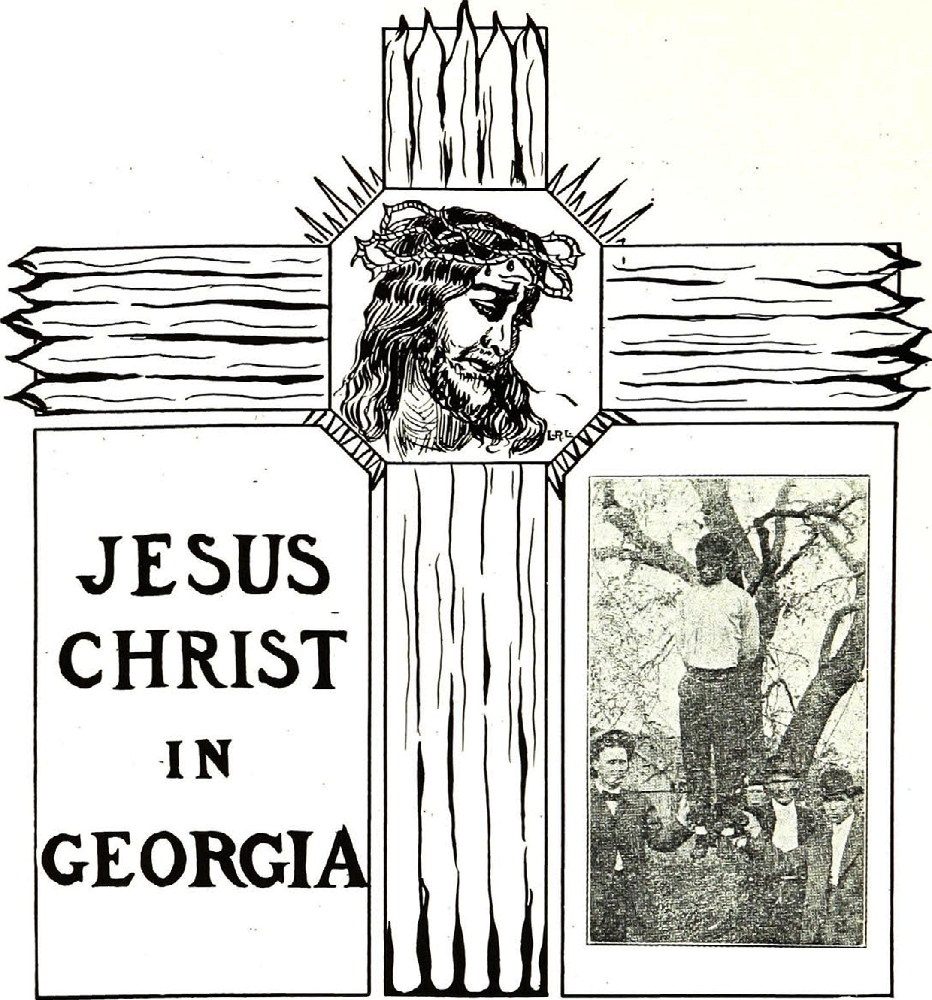

<!--
title:   Jesus Christ in Georgia
author:  Du Bois, W.E.B.
journal: The Crisis
year:    1911
volume:  3
issue:   2
pages:   70-74
-->

# Jesus Christ in Georgia (1911)

  

The convict guard laughed.

"I don't know," he said, "I hadn't thought of that------"

He hesitated and looked at the stranger curiously. In the solemn twilight he got an impression of unusual height and soft dark eyes.

"Curious sort of acquaintance for the Colonel," he thought; then he continued aloud: "But that nigger there is bad; a born thief and ought to be sent up for life; is practically; got ten years last time------"

Here the voice of the promoter talking within interrupted; he was bending over his figures, sitting by the Colonel. He was slight, with a sharp nose.

"The convicts," he said, "would cost us $96 a year and board. Well, we can squeeze that so that it won't be over $125 apiece. Now, if these fellows are driven, they can build this line within twelve months. It will be running next April. Freights will fall fifty per cent. Why, man, you will be a millionaire in less than ten years."

The Colonel started. He was a thick, short man, with clean-shaven face, and
a certain air of breeding about the lines of his countenance; the wordmillionaire sounded well in his ears. He thought---he thought a great deal; he almost heard the puff of the fearfully costly automobile that was coming up the road, and he said:

"I suppose we might as well hire them."

"Of course," answered the promoter.

The voice of the tall stranger in the corner broke in here:

"It will be a good thing for them?" he said, half in question.

The Colonel moved. "The guard makes strange friends," he thought to himself. "What's this man doing here, anyway?" He looked at him, or rather, looked at his eyes, and then somehow felt a warming toward him. He said:

"Well, at least it can't harm them---they're beyond that."

"It will do them good, then," said the stranger again. The promoter shrugged his shoulders.

"It will do us good," he said.

But the Colonel shook his head impatiently. He felt a desire to justify himself before those eyes, and he answered: "Yes, it will do them good; or, at any rate, it won't make them any worse than they are."

Then he started to say something else, but here sure enough the sound of the automobile breathing at the gate stopped him and they all arose.

"It is settled, then," said the promoter. "Yes," said the Colonel, signing his name and turning toward the stranger again.

"Are you going into town?" he asked with the Southern courtesy of white man to white man in a country town. The stranger said he was.

"Then come along in my machine. I want to talk to you about this."

They went out to the car. The stranger as he went turned again to look back at the convict. He was a tall, powerfully built black fellow. His face was sullen, with a low forehead, thick, hanging lips, and bitter eyes. There was revolt written about the mouth, and a hangdog expression. He stood bending over his pile of stones pounding listlessly.

Beside him stood a boy of twelve, yellow, with a hunted, crafty look. The convict raised his eyes, and they met the eyes of the stranger. The hammer fell from his hands.

The stranger turned slowly toward the automobile, and the Colonel introduced him. He could not exactly catch the foreign-sounding name, but he mumbled something as he presented him to his wife and little girl, who were waiting. As they whirled away he started to talk, but the stranger had taken the little girl into his lap, and together they conversed in low tones all the way home.

In some way, they did not exactly know how, they got the impression that the man was a teacher, and of course he must be a foreigner. The long cloak-like coat told this. They rode in the twilight through the half-lighted town, and at last drew up before the Colonel's mansion, with its ghostlike pillars.

The lady in the back seat was thinking of the guests she had invited to dinner, and wondered if she ought not to ask this man to stay. He seemed cultured, and she supposed he was some acquaintance of the Colonel's. It would be rather a distinction to have him there, with the Judge's wife and daughter and the Rector. She spoke almost before she thought:

"You will enter and rest awhile?" The Colonel and the little girl insisted. For a moment the stranger seemed about to refuse. He said he was on his way North, where he had some business for his father in Pennsylvania. Then, for the child's sake, he consented. Up the steps they went, and into the dark
parlor, and there they sat and talked a long time. It was a curious conversation. Afterward they did not remember exactly what was said, and yet they all remembered a certain strange satisfaction in that long talk.

Presently the nurse came for the reluctant child, and the hostess bethought herself:

"We will have a cup of tea---you will be dry and tired."

She rang and switched on a blaze of light. With one accord they all looked at the stranger, for they had hardly seen him well in the glooming twilight. The woman started in amazement and the Colonel half rose in anger. Why, the man was a mulatto, surely---even if he did not own the Negro blood, their practised eyes knew it. He was tall and straight, and the coat looked like a Jewish gabardine. His hair hung in close curls far down the sides of his face, and his face was olive, even yellow.

A peremptory order rose to the Colonel's lips, and froze there as he caught the stranger's eyes. Those eyes, where had he seen those eyes before? He remembered them long years ago---the soft tear-filled eyes of a brown girl. He remembered many things, and his face grew drawn and white. Those eyes kept burning into him, even when they were turned half away toward the staircase, where the white figure of the child hovered with her nurse, and waved goodnight. The lady sank into her chair and thought: "What will the Judge's wife say? How did the Colonel come to invite this man here? How shall we be rid of him?" She looked at the Colonel in reproachful consternation.

Just then the door opened and the old butler came in. He was an ancient black man with tufted white hair, and he held before him a large silver tray filled with a china tea service. The stranger rose slowly and stretched forth his hands as if to bless the viands. The old man paused in bewilderment, tottered and then, with sudden gladness in his eyes, dropped to his knees as the tray crashed to the floor.

"My Lord!" he whispered, "and My God!" But the woman screamed: "Mother's china!"

The doorbell rang.

"Heavens! Here is the dinner party!" exclaimed the lady.

She turned toward the door, but there in the hall, clad in her night clothes, was the little girl. She had stolen down the stairs to see the stranger again, and the nurse above was calling in vain. The woman felt hysterical and scolded at the nurse, but the stranger had stretched out his arms, and with a glad cry the child nestled in them. "Of such," he whispered, "is the Kingdom of Heaven," as
he slowly mounted the stairs with his little burden.

The mother was glad; anything to be rid of the interloper even for a moment. The bell rang again, and she hastened toward the door, which the loitering black maid was just opening. She did not notice the shadow of the stranger as he came slowly down the stairs and paused by the newel post, dark and silent.

The Judge's wife entered. She was an old woman, frilled and powdered into a caricature of youth, and gorgeously gowned. She came forward, smiling with extended hands, but just as she was opposite the stranger, a chill from somewhere seemed to strike her, and she shuddered and cried: "What a draft!" as she drew a silken shawl about her and shook hands cordially; she forgot to ask who the stranger was. The Judge strode in unseeing, thinking of a puzzling case of theft.

"Eh? What? Oh---er---yes---good-evening," he said, "good-evening."

Behind them came a young woman in the glory of youth, daintily silked, with diamonds around her fair neck, beautiful in face and form. She came in lightly, but stopped with a little gasp; then she laughed gaily and said:

"Why, I beg your pardon. Was it not curious? I thought I saw there behind your man"---she hesitated ("but he must be a servant," she argued)---"the shadow of wide white wings. It was but the light on the drapery. What a turn it gave me---so glad to be here!" And she smiled again. With her came a tall and haughty naval officer. Hearing his lady refer to the servant, he hardly looked at him, but held his gilded cap and cloak carelessly toward him; the stranger took them and placed them carefully on the rack.

Last came the Rector, a man of forty, and well clothed. He started to pass the stranger, stopped and looked at him inquiringly.

"I beg your pardon," he said, "I beg your pardon, I think I have met you?"

The stranger made no answer, and the hostess nervously hurried the guests on. But the Rector lingered and looked perplexed.

"Surely I know you; I have met you somewhere," he said, putting his hand vaguely to his head. "You---you remember me, do you not?"

The stranger quietly swept his cloak aside, and to the hostess' unspeakable relief moved toward the door.

"I never knew you," he said in low tones, as he went.

The lady murmured some faint excuse about intruders, but the Rector stood with annoyance written on his face.

"I beg a thousand pardons," he said to the hostess absently. "It is a great pleasure to be here---somehow I thought
I knew that man. I am sure I knew him, once."

The stranger had passed down the steps, and as he went the nurse-maid, lingering at the top of the staircase, flew down after him, caught his cloak, trembled, hesitated, and then kneeled in the dust. He touched her lightly with his hand and said, "Go, and sin no more."

With a glad cry the maid left the house with its open door and turned north, running, while the stranger turned eastward to the night. As they parted a long low howl rose tremulously and reverberated through the town. The Colonel's wife within shuddered.

"The bloodhounds," she said. The Rector answered carelessly.

"Another one of those convicts escaped, I suppose; really, they need severer measures." Then he stopped. He was trying to remember that stranger's name. The Judge's wife looked about for the draft and arranged her shawl. The girl glanced at the white drapery in the hall, but the young officer was bending over her, and the fires of life burned in her veins.

Howl after howl rose in the night, swelled and died away. The stranger strode rapidly along the highway and out into the deep forest. There he paused and stood waiting, tall and still. A mile up the road behind him a man was running, tall and powerful and black, with crime-stained face, with convict's stripes upon him and shackles on his legs. He ran and jumped in little short steps, and the chains rang. He fell and rose again, while the howl of the hounds rung harder behind him.

Into the forest he leaped and crept and jumped and ran, streaming with sweat; seeing the tall form rise before him, he stopped suddenly, dropped his hands in sullen impotence and sank panting to the earth. A bloodhound shot into the woods behind him, howled, whined and fawned before the stranger's' feet. Hound after hound bayed, leapt and lay there; then silent, one by one, with bowed head, they crept backward toward the town.

The stranger made a cup of his hands and gave the man water to drink, bathed his hot head, and gently took the chains and irons from his feet. By and by the convict stood up. Day was dawning above the treetops. He looked into the stranger's face, and for a moment a gladness swept over the stains of his face.

"Why, you'se a nigger, too," he said.

Then the convict seemed anxious to justify himself.

"I never had no chance," he said furtively.

"Thou §halt not steal," said the stranger.

The man bridled.

"But how about them? Can they steal?
Didn't they steal a whole year's work and then, when I stole to keep from
starving----" he glanced at the stranger.
"No, I didn't steal just to keep from starving. I stole to be stealing. I can't help stealing. Seems like when I sees things I just must---but, yes, I'll try!" The convict looked down at his striped clothes, but the stranger had taken off his long coat and put it around him, and the stripes disappeared. In the opening morning the black man started toward the low log farmhouse in the distance, and the stranger stood watching him. There was a new glory in the day. The black man's face cleared up and the farmer was glad to get him.

All day he worked as he had never worked before, and the farmer gave him some cold food toward night.

"You can sleep in the barn," he said, and turned away.

"How much do I git a day?" asked the man.

The farmer scowled:

"If you'll sign a contract for the season," he said, "I'll give you ten dollars a month."

"I won't sign no contract to be a slave," said the man doggedly.

"Yes, you will," said the farmer, threateningly, "or I'll call the convict guard." And he grinned.

The convict shrunk and slouched to the barn. As night fell he looked out and saw the farmer leave the place. Slowly he crept out and sneaked toward the house. He looked into the kitchen door. No one was there, but the supper was spread as if the mistress had laid it and gone out. He ate ravenously. Then he looked into the front room and listened. He could hear low voices on the porch. On the table lay a silver watch. He gazed at it, and in a moment was beside it, with his hand on it. Quickly he slipped out of the house and slouched toward the field. He saw his employer coming along the highway. He fled hack stealthily and around to the front of the house, when suddenly he stopped. He felt the great dark eyes of the stranger and saw the same dark, cloak-like coat, where he was seated on the doorstep talking with the mistress of the house. Slowly, guiltily, he turned back, entered the kitchen and laid the watch where he had found it; and then he rushed wildly with arms outstretched back toward the stranger.

The woman had laid supper for her husband, and going down from the house had walked out toward a neighbor's. She was gone but a little while, and when she came back she started to see a dark figure on the doorsteps under the tall red oak. She thought it was the new Negro hand until he said in a soft voice: "Will you give me bread?"

Reassured at the voice of a white man,
she answered quickly in her soft Southern tones:

"Why, certainly."

She was a little woman. Once she had been handsome, but now her face was drawn with work and care. She was nervous, and was always thinking, wishing, wanting for something. She went in and got him some cornbread and a glass of cool, rich buttermilk, and then came out and sat down beside him. She began, quite unconsciously, to tell him about herself---the things she had done, and had not done, and the things she had wished. She told him of her husband, and this new farm they were trying to buy. She said it was so hard to get niggers to work. She said they ought all to be in the chain gang and made to work. Even then some ran away. Only yesterday one had escaped.

At last she gossiped of her neighbors; how good they were and how bad.

"And do you like them all?" asked the stranger.

She hesitated.

"Most of them," she said; and then, looking up into his face and putting her hand in his as though he were her father, she said:

"There are none I hate; no, none at all."

He looked away and said dreamily:

"You love your neighbor as yourself?"

She hesitated---

"I try------" she began, and then looked
the way he was looking; down under the hill, where lay a little, half-ruined cabin.

"They are niggers," she said briefly.

He looked at her. Suddenly a confusion came over her, and she insisted, she knew not why---

"But they are niggers."

With a sudden impulse she rose, and hurriedly lighted the lamp that stood just within the door and held it above her head. She saw his dark face and curly hair. She shrieked in angry terror, and rushed down the path; and just as she rushed down, the black convict came running up with hands outstretched. They met in midpath, and before he could stop he had run against her, and she fell heavily to earth and lay white and still. Her husband came rushing up with cry and oath:

"I knew it," he said; "it is that runaway nigger." He held the black man struggling to the earth, and raised his voice to a yell. Down the highway came the convict guard with hound and mob and gun. They poured across the fields. The farmer motioned to them.

"He---attacked---my wife," he gasped.

The mob snarled and worked silently. Right to the limb of the red oak they hoisted the struggling, writhing black man, while others lifted the dazed woman. Right and left as she tottered to the house she searched for the stranger,
with a sick yearning, but the stranger was gone. And she told none of her guest.

"No---no---I want nothing," she insisted, until they left her, as they thought, asleep. For a time she lay still listening to the departure of the mob. Then she rose. She shuddered as she heard the creaking of the limb where the body hung. But resolutely she crawled to the window and peered out into the moonlight; she saw the dead man writhe. He stretched his arms out like a cross, looking upward. She gasped and clung to the window sill. Behind the swaying body, and down where the little, half-ruined cabin lay, a single flame flashed up amid the far-off shout and cry of the mob. A fierce joy sobbed up through the terror in her soul and then sank abashed as she watched the flame rise. Suddenly whirling into one great crimson column it shot to the top of the sky
and threw great arms athwart the gloom until above the world and behind the roped and swaying form below hung quivering and burning a great crimson cross.

She hid her dizzy, aching head in an agony of tears, ana dared not look, for she knew. Her dry lips moved: "Despised and rejected of men."

She knew, and the very horror of it lifted her dull and shrinking eyelids. There, heaven-tall, earth-wide, hung the stranger on the crimson cross, riven and bloodstained with thorn-crowned head and pierced hands. She stretched her arms and shrieked.

He did not hear. He did not see. His calm dark eyes all sorrowful were fastened on the writhing, twisting body of the thief, and a voice came out of the winds of the night, saying:

"This day thou shalt be with me in Paradise!"

______________
*Citation:* Du Bois, W.E.B. 1911. "Jesus Christ in Georgia." *The Crisis*. 3(2):70&ndash;74.