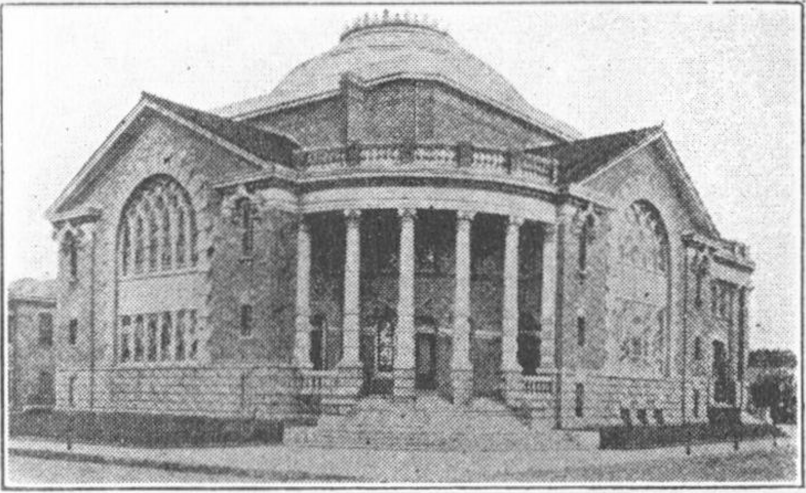
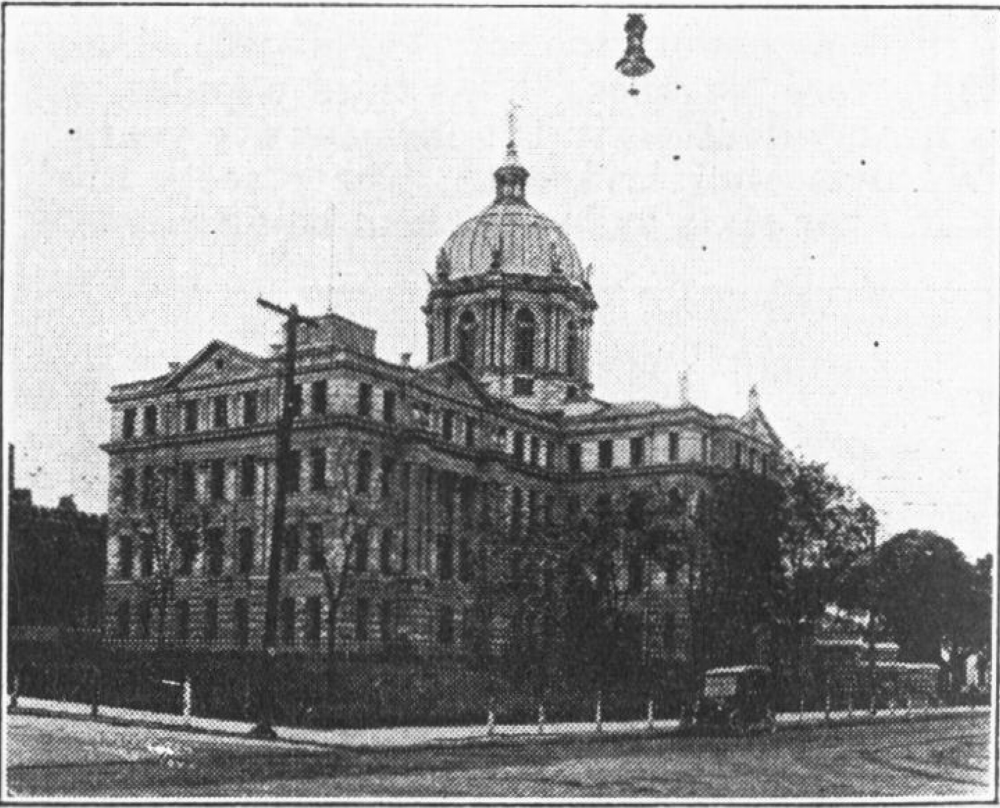
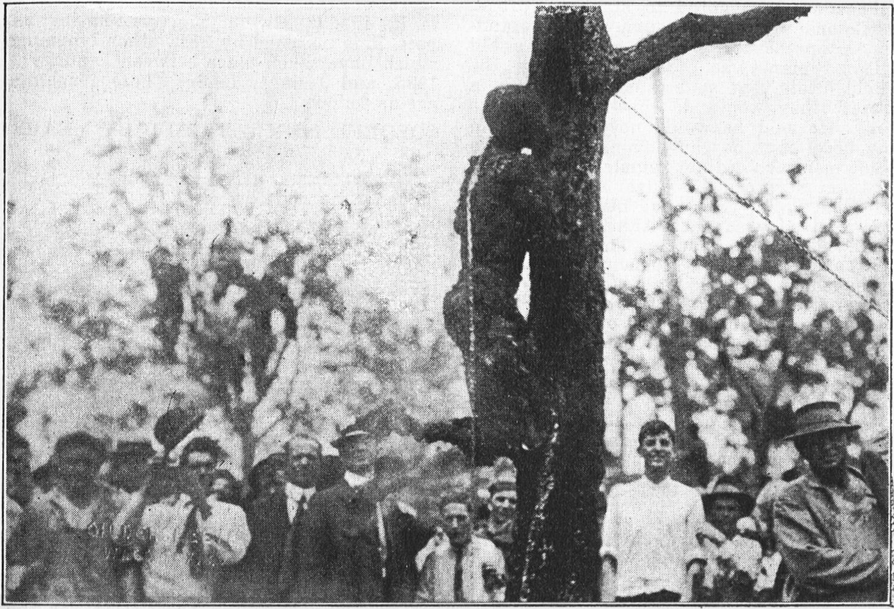
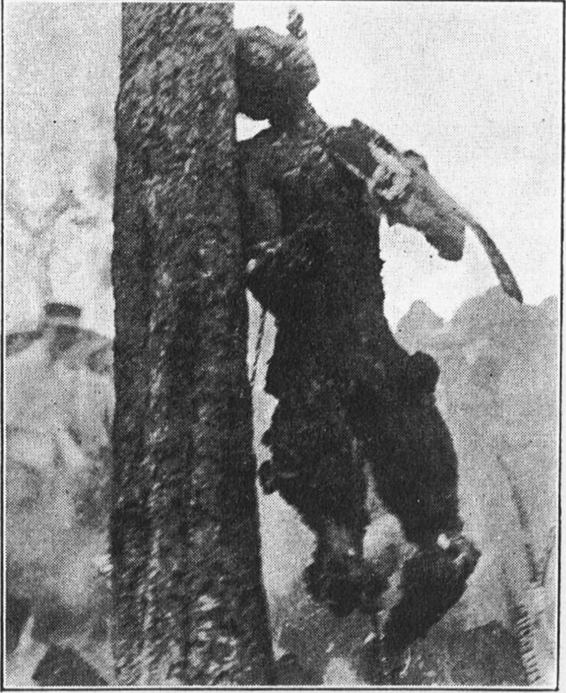
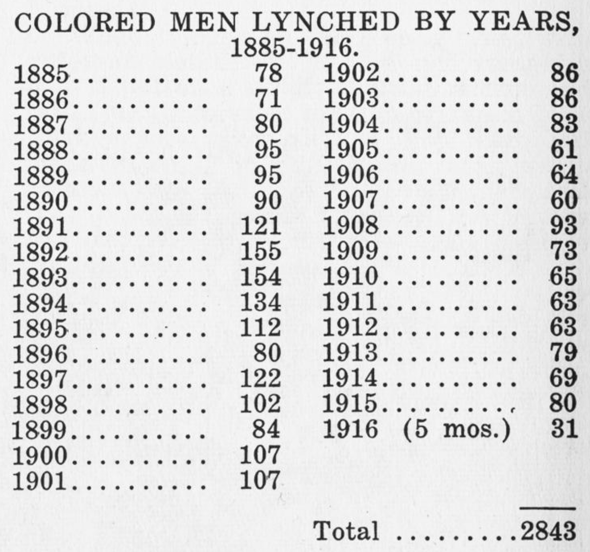
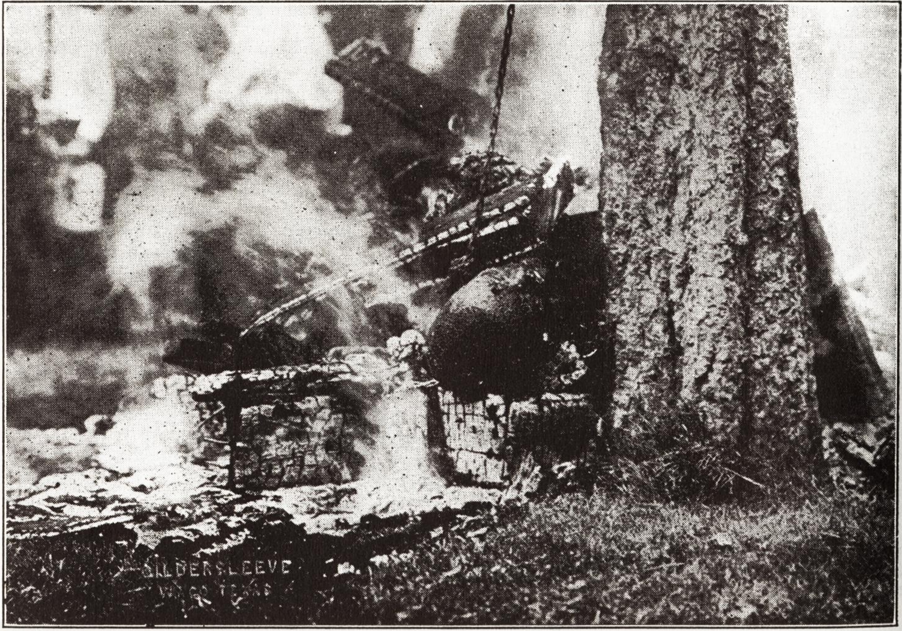

<!--
title:   The Waco Horror
author:  Du Bois, W.E.B.
journal: The Crisis
year:    1916
volume:  12
issue:   3-Supplement
pages:   1-8
-->
# The Waco Horror (1916)

```{margin}
Suffrage activist [Elisabeth Freeman](https://en.wikipedia.org/wiki/Elisabeth_Freeman) conducted much of the primary research for this article.
```

An account of the recent burning of a human being at Waco, Tex., as reported by a special agent of the National Association for the Advancement of Colored People, 70 Fifth Avenue, New York City.

## 1. The City.

The city of Waco, Tex., is the county seat of McLennan County. It is situated on the Brazos river, about half way between Dallas and Austin. It is the junction point of seven railways. The city is in a fertile agricultural region with grain and cotton as the chief products, and with nearly two hundred manufacturing establishments, representing some seventy different industries.

It had a population of 14,445 in 1890 which increased to 20,686 in 1900, and to 26,425 in 1910. The white population in these twenty years has almost exactly doubled. The colored population has increased from 4,609 to 6,067, forming thus 23% of the population. The bulk of this population is native white of native parentage, there being only about 1,000 foreigners in the city.

The whole of McLennan county contained in 1910 a population of 73,250 of whom 17,234 were Negroes. This total population has nearly doubled in the last twenty years.

Waco is well laid out. The streets are broad, over sixty miles of them being paved. The sewer system of one hundred miles is excellent. There is a fine city-owned water system, and parks on the surrounding prairies.

   
***Baylor University, Waco***

There are thirty-nine white and twenty-four colored churches in Waco. By denominations the white churches are: Baptist, 14; Methodist, 9; Christian, 4; Presbyterian, 3; Jewish, 2; Episcopal, 2; Evangelistic, 1; Catholic, 1; Christian Science, 1; Salvation Army, 1.

The colleges are: Baylor University, Baylor Academy, the Catholic College, the Independent Biblical and Industrial School, all white; and the Central Texas College and Paul Quinn, colored colleges. There are also the A. & M. College, the Gurley School, the Waco Business College, the Provident Sanitarium, and the Training School.

Baylor University was founded in 1854 and has between 1,200 and 1,300 students. It is co-educational. The president is running for the United States Senate.

Two high schools serve the white and colored population, and there are seven banks, including four national banks.


***Riggins Hotel, Waco***

In other words, Waco is a typical Southern town, alert, pushing, and rich.

## 2. The Crime.

Near the country town of Robinson, some six miles from Waco, lived a white family of four, named Fryar, who owned a small farm. This they cultivated themselves with the help of one hired man, a colored boy of seventeen, named Jesse Washington.

Jesse was a big, well-developed fellow, but ignorant, being unable either to read or write. He seems to have been sullen, and perhaps mentally deficient, with a strong, and even daring temper. It is said that on the Saturday before the crime, he had a fight with a neighboring white man, and the man had threatened to kill him.


***The First Baptist Church, Waco***

On Monday, May 8, while Mr. Fryar, his son of fourteen, and his daughter of twenty-three, were hoeing cotton in one part of their farm, the boy, Jesse, was plowing with his mules and sowing cotton seed near the house where Mrs. Fryar was alone. He went to the house for more cotton seed. As Mrs. Fryar was scooping it up for him into the bag which he held, she scolded him for beating the mules. He knocked her down with a blacksmith's hammer, and, as he confessed, criminally assaulted her; finally he killed her with the hammer. The boy then returned to the field, finished his work, and went home to the cabin, where he lived with his father and mother and several brothers and sisters.

When the murdered woman was discovered suspicion pointed to Jesse Washington, and he was found sitting in his yard whittling a stick. He was arrested and immediately taken to jail in Waco. Tuesday a mob visited the jail. They came in with about thirty automobiles, each holding as many as could be crowded in. There was no noise, no tooting of horns, the lights were dim, and some had no lights at all. These were all Robinson people. They looked for the boy, but could not find him, for he had been taken to a neighboring county where the sheriff obtained a confession from him. Another mob went to this county seat to get the boy, but he was again removed to Dallas. Finally, the Robinson people pledged themselves not to lynch the boy if authorities acted promptly, and if the boy would waive his legal rights.

  
***The Court House, Waco***

A second confession in which the boy waived all his legal rights was obtained in the Dallas jail. The Grand Jury indicted him on Thursday, and the case was set for trial Monday, May 15.

Sunday night, at midnight, Jesse Washington was brought from Dallas to Waco, and secreted in the office of the judge. There was not the slightest doubt but that he would be tried and hanged the next day, if the law took its course.

There was some, but not much doubt of his guilt. The confessions were obtained, of course, under duress, and were, perhaps, suspiciously clear, and not entirely in the boy's own words. It seems, however, probable that the boy was guilty of murder, and possibly of premeditated rape.

  
***The City Hall (The Boy Was Burned Back of This Hall)***

## 3. Waco Politics.

Meantime the exigencies of Waco politics are said to have demanded a lynching. Our investigator says:
> They brought the boy back to Waco because a lynching was of political value to the county officials who are running for office. Every man I talked with said that politics was at the bottom of the whole business. All that element who took part in the lynching will vote for the Sheriff. The Judge is of value to his party because he appoints three commissioners of the jury, and these commissioners pick the Grand Jury.

The District Judge of the Criminal Court is R.I. Munroe, appointed by Governor Campbell. He is a low order of politician, and a product of a loyal machine. His reputation for morality is bad, and his practice at the Bar has been largely on behalf of the vicious interests.

The Sheriff of the county, S.S. Fleming, is a candidate for re-election, and has made much political capital out of the lynching. He says, in an advertisement in the Waco *Semi-Weekly Tribune*:

> Mr. Fleming is diseased with a broad philanthropy. He believes in the equality of man. He carries with him in the daily walk of his officialdom none of the 'boast of heraldry or the pomp of power.' He is just as courteous, just as obliging, just as accommodating as Sherriff as he was when selling buggies and cultivators for the hardware company. He presents to the voters for their endorsement the record made by him and his corps of splendid deputies.

Our investigator says:

> When I saw the Sheriff (Fleming) he had a beautiful story to tell. He had his story fixed up so that the entire responsibility was shifted on the Judge. The Judge admitted he could have had a change of venue, but said the mob anywhere would have done the same thing.

Meanwhile, the tip went out:

> The crowd began pouring into the town the day before and continued early Monday morning. The court room was packed full and a crowd of 2,000 was on the outside. The jurors could scarcely get in and out from their seats. I asked the Judge if he could not have cleared the court room, and he answered that I did not know the South. I said, 'If a person is big enough, he can get up and stop the biggest mob.' He asked, 'Do you want to spill innocent blood for a n&#11834;?'
> &nbsp;    
> Some one had arranged it so that it would be easy to get the boy out of the courtroom. A door which opened by a peculiar device had been fixed so it would open. One of the jurors was a convicted murderer with a suspended sentence over him.    
> &nbsp;    
> Lee Jenkins is the best deputy sheriff, but he is under Fleming. Barney Goldberg, the other deputy sheriff, said, 'If Lee Jenkins had had it, it would never have been, but we are working for the man higher up and must take our orders from him.' Barney Goldberg knows perfectly well that if Fleming is not re-elected, and the other candidate gets in, he will be out of a job. The other nominee for sheriff, Buchanan, is reported to be unable to read and write, but is said to have three dead 'n&#11834;s' to his 'credit.'       
> &nbsp;    
> The boy, Jesse Washington, was asked what he thought about the mob coming after him. He said, 'They promised they would not if I would tell them about it.'
He seemed not to care, but was thoroughly indifferent."    

The trial was hurried through. The Waco *Semi-Weekly Tribune,* May 17 says: > The jury returned into court at 11:22 and presented a verdict: 'We, the jury, find the defendant guilty of murder as charged in the indictment and assess his punishment at death.' This was signed by W.B. Brazelton, foreman.   
> &nbsp;    
> 'Is that your verdict, gentlemen?' asked Judge Munroe.        
> &nbsp;    
> They answered, 'yes.'    
> &nbsp;    
> Judge Munroe began writing in his docket. He had written: 'May 15, 1916: Jury verdict of guilty,' and as he wrote there was a hush over the entire court room. It was a moment of hesitation, but just a moment. Then the tall man started over the heads of the crowd. Fred H. Kingsbury, who was standing alongside of Judge Munroe, said, 'They are coming after him,' and as the Judge looked up, the wave of people surged forward." The court room accommodates 500 persons, but the Judge had allowed 1,500 persons to crowd in.

```{margin}
The lynching images are by Waco photographer [Fred Gildersleeve](https://en.wikipedia.org/wiki/Fred_Gildersleeve), who later sold them as postcards.
```

  
***The Waiting Crowd***

Our investigator continues:
> The stenographer told me that there was a pause of a full minute. He said the people crowded around him and he knew what was coming, so he slipped out of the door back of the Sheriff, with his records; and Sheriff Fleming slipped out also.    
> &nbsp;    
> Fleming claims that all he was called upon to do in the way of protecting the boy was to get him to court.   
> &nbsp;    
"A big fellow in the back of the court room yelled, 'Get the N****!' Barney Goldberg, one of the deputy sheriffs, told me that he did not know that Fleming had dropped orders to let them get the Negro, and pulled his revolver. Afterwards he got his friends to swear to an affidavit that he was not present. Fleming said he had sworn in fifty deputies. I asked him where they were. He asked, 'Would you want to protect the n&#11834;?' The judge made no effort to stop the mob, although he had firearms in his desk.

## 4. The Burning.

> They dragged the boy down the stairs, put a chain around his body and hitched it to an automobile. The chain broke. The big fellow took the chain off the Negro under the cover of the crowd and wound it around his own wrist, so that the crowd jerking at the chain was jerking at the man's wrist and he was holding the boy. The boy shrieked and struggled.    
> &nbsp;    
> The mob ripped the boy's clothes off, cut them in bits and even cut the boy. Someone cut his ear off; someone else unsexed him. A little girl working for the firm of Goldstein and Mingle told me that she saw this done.    
> &nbsp;    
> I went over the route the boy had been taken and saw that they dragged him between a quarter and half a mile from the Court House to the bridge and then dragged him up two blocks and another block over to City Hall. After they had gotten him up to the bridge, someone said that a fire was already going up at City Hall, and they turned around and went back. Several people denied that the fire was going, but the photograph shows that it was. They got a little boy to light the fire.    
> &nbsp;    
> While a fire was being prepared of boxes, the naked boy was stabbed and the chain put over the tree. He tried to get away, but could not. He reached up to grab the chain and they cut off his fingers. The big man struck the boy on the back of the neck with a knife just as they were pulling him up on the tree. Mr. Lester thought that was practically the death blow. He was lowered into the fire several times by means of the chain around his neck. Someone said they would estimate the boy had about twenty-five stab wounds, none of them death-dealing.    
> &nbsp;    
> About a quarter past one a fiend got the torso, hung a rope over the pummel of a saddle, and dragged it around through the streets of Waco.   
> &nbsp;    
> Very little drinking was done.    
> &nbsp;    
> The tree where the lynching occurred was right under the Mayor's window. Mayor Dollins was standing in the window, not concerned about what they were doing to the boy, but that the tree would be destroyed. The Chief of Police also witnessed the lynching. The names of five of the leaders of the mob are known to this Association, and can be had on application by responsible parties.
"Women and children saw the lynching. One man held up his little boy above the heads of the crowd so that he could see, and a little boy was in the top of the very tree to which the colored boy was hung, where he stayed until the fire became too hot."


***The Mob***

Another account, in the Waco *Times Herald*, Monday night, says:
> Great masses of humanity flew as swiftly as possible through the streets of the city in order to be present at the bridge when the hanging took place, but when it was learned that the Negro was being taken to the City Hall lawn, crowds of men, women, and children turned and hastened to the lawn.    
> &nbsp;    
> On the way to the scene of burning people on every hand took a hand in showing their feelings in the matter by striking the Negro with anything obtainable, some struck him with shovels, bricks, and clubs, and others stabbed him and cut him until when he was strung up his body was a solid color of red, the blood of many wounds inflicted covered him from head to foot.    
> &nbsp;    
> Dry goods boxes and all kinds of inflammable material were gathered, and it required but an instant to convert this into seething flames. When the Negro was first hoisted into the air his tongue protruded from his mouth and his face was besmeared with blood.    
> &nbsp;    
> Life was not extinct within the Negro's body, although nearly so, when another chain was placed around his neck and thrown over the limb of a tree on the lawn, everybody trying to get to the Negro and have some part in his death. The infuriated mob then leaned the Negro, who was half alive and half dead, against the tree, he having just strength enough within his limbs to support him. As rapidly as possible the Negro was then jerked into the air at which a shout from thousands of throats went up into the morning air and dry goods boxes, excelsior, wood, and every other article that would burn was then in evidence, appearing as if by magic. A huge dry goods box was then produced and filled to the top with all of the material that had been secured. The Negro's body was swaying in the air, and all of the time a noise as of thousands was heard and the Negro's body was lowered into the box.    
> &nbsp;    
> No sooner had his body touched the box than people pressed forward, each eager to be the first to light the fire, matches were touched to the inflammable material and as smoke rapidly rose in the air, such a demonstration as of people gone mad was never heard before. Everybody pressed closer to get souvenirs of the affair. When they had finished with the Negro his body was mutilated.    
> &nbsp;    
> Fingers, ears, pieces of clothing, toes and other parts of the Negro's body were cut off by members of the mob that had crowded to the scene as if by magic when the word that the Negro had been taken in charge by the mob was heralded over the city. As the smoke rose to the heavens, the mass of people, numbering in the neighborhood of 10,000 crowding the City Hall lawn and overflowing the square, hanging from the windows of buildings, viewing the scene from the tops of buildings and trees, set up a shout that was heard blocks away.    
> &nbsp;    
> Onlookers were hanging from the windows of City Hall and every other building that commanded a sight of the burning, and as the Negro's body commenced to burn, shouts of delight went up from the thousands of throats and apparently everybody demonstrated in some way their satisfaction at the retribution that was being visited upon the perpetrator of such a horrible crime, the worst in the annals of McLennan county's history.    
> &nbsp;    
> The body of the Negro was burned to a crisp, and was left for some time in the smoldering remains of the fire. Women and children who desired to view the scene were allowed to do so, the crowds parting to let them look on the scene. After some time the body of the Negro was jerked into the air where everybody could view the remains, and a mighty shout rose on the air.    
> &nbsp;    
> Photographer Gildersleeve made several pictures of the body as well as the large crowd which surrounded the scene as spectators.

The photographer knew where the lynching was to take place, and had his cameral paraphernalia in the City Hall. He was called by telephone at the proper moment. He writes us:

> We have quit selling the mob photos, this step was taken because our 'City dads' objected on the grounds of 'bad publicity,' as we wanted to be boosters and not knockers, we agreed to stop all sale. - F.A. Gildersleeve.

Our agent continues:
> While the torso of the boy was being dragged through the streets behind the horse, the limbs dropped off and the head was put on the stoop of a disreputable woman in the reservation district. Some little boys pulled out the teeth and sold them to some men for five dollars apiece. The chain was sold for twenty-five cents a link.    
> &nbsp;    
> From the pictures, the boy was apparently a wonderfully built boy. The torso was taken to Robinson, hung to a tree, and shown off for a while, then they took it down again and dragged it back to town and put it on the fire again at five o'clock.

## 5. The Aftermath.

> I tried to talk to the Judge. I met him on the street and said, 'I want to talk to you about something very important.' He asked, 'What is the nature of it?' I said, 'I want to get your opinion about lynching.' He said, 'No, I refuse to talk with you about that. What do you want it for?' I said, 'If you refuse to talk with me, there is no use of telling you what I want it for.'   
> &nbsp;    
> When I met him the second time, with different clothes on, he did not recognize me. I put on a strong English accent and said I was interested in clippings from New York papers which showed that Waco had made for itself an awful name, and I wanted to go back and make the northerners feel that Waco was not so bad as the papers had represented. Then he gave me the Court records."   

Our investigator continues:

> I went to the newspaper offices. They were all of the opinion that the best thing to do was to hush it up. The Dallas News did not cite anything editorially because not long ago they had done something quite as bad and the boy was not guilty.


***The Victim***

> With the exception of the *Tribune*, all the papers had simply used it as a news item and let it drop. The *Tribune* is owned by Judge McCullum, who says anything he pleases. He is nearly blind. When I read the article to him I said, 'I would like to ask you, if that had been a colored woman and a white boy, would you have protected that woman?' He answered, 'No.' 'If it had been a colored boy and a colored woman? No.' 'We would not have stopped the n&#11834;s doing anything they wanted to.' 'Do you think they would?' 'No.' 'Then, they prove their superior civilization.' Then he began to tell me how he knew all about the n&#11834;s and we northerners do not. He said that as an old southerner he knew perfectly well how to handle the colored population. He told me how he was raised with them, had a colored mammy, nursed at her breast, etc.


***The Torture (Note the "Frenzied" Mob)***

> There is a bunch of people in Waco who are dying to see someone go forward and make a protest, but no one in Waco would do it. Ex-Mayor Mackaye and Colonel Hamilton both said, 'We do not know what to do. We are not organized to do it. It is a case of race and politics.'    
> &nbsp;    
> I put out a lot of wires for a lawyer to take up the case, but no human being in Waco would take it up. I wrote to a friend in Austin and one in Houston, and the Austin friend telegraphed me that he would send me word as soon as he had found someone. I had a letter from the Houston friend who gave me the names of three lawyers, but I am not sure whether they would take up a case of this kind. All have their doubts of ever getting the case into court.    
> &nbsp;    
> I did not dare ask much about lawyers.



> As a result of the lynching a Sunday School Convention which was to have met there, with 15,000 delegates, has been stopped.
> &nbsp;    
> W.A. Brazelton, the foreman of the Jury, was very outspoken against the whole affair and blames the officials for it. He felt that as foreman of the Jury he could not lead in a protest but *thought* some protest ought to be made.    
> &nbsp;    
> Mr. Ainsworth, one of the newspaper men, seemed the only one who wanted to start a protest.    
> &nbsp;    
> Colonel Hamilton, a man of high standing, a northerner, and at one time a big railroad man, was outspoken against the whole affair, but said that if he led in a protest they would do the same thing to him. He said that he would never register in any hotel that he came from Waco. Two Waco men who did not register from Waco.    
> &nbsp;    
> Allan Stanford, ex-Mayor of Waco, saw the Sheriff and the Judge before the trial and received assurances that the lynching would not take place. They shut the mouths of the better element by telling them that the Robinson people had promised not to do it. They had gotten the promise of the Robinson people that they would not touch the boy during the trial, but they did not get the pledge of the disreputable bunch of Waco that they would not start the affair.    
> &nbsp;    
> Judge Spell said the affair was deplorable, but the best thing was to forget it.
"When representing myself as a news reporter, I asked, 'What shall I tell the people up North?' Ex-Mayor Mackaye said, 'Fix it up as well as you can for Waco, and make them understand that the better thinking men and women of Waco were not in it.' I said, 'But some of your better men were down there.' The whole thing savors so rotten because the better men have not tried to protest against it. Your churches have not said a word. Dr. Caldwell was the only man who made any protest at all."

## 6. The Lynching Industry

This is an account of one lynching. It is horrible, but it is matched in horror by scores of others, in the last thirty years, and in its illegal, law-defying, race-hating aspect, it is matched by 2842 other lynchings which have taken place between January 1, 1885, and June 1, 1916. These lynchings are as follows:



What are we going to do about this record? The civilization of America is at stake. The sincerity of Christianity is challenged. The National Association for the Advancement of Colored People proposes immediately to raise a fund of at least $10,000 to start a crusade against this modern barbarism. Already $2,000 is promised, conditional on our raising the full amount.

Interested persons may write to Roy Nash, secretary, 70 Fifth Avenue, New York City.

    
***Finis***

______________
*Citation:* Du Bois, W.E.B. 1916. "The Waco Horror." *The Crisis*. 12(3-Supplement):1&ndash;8.