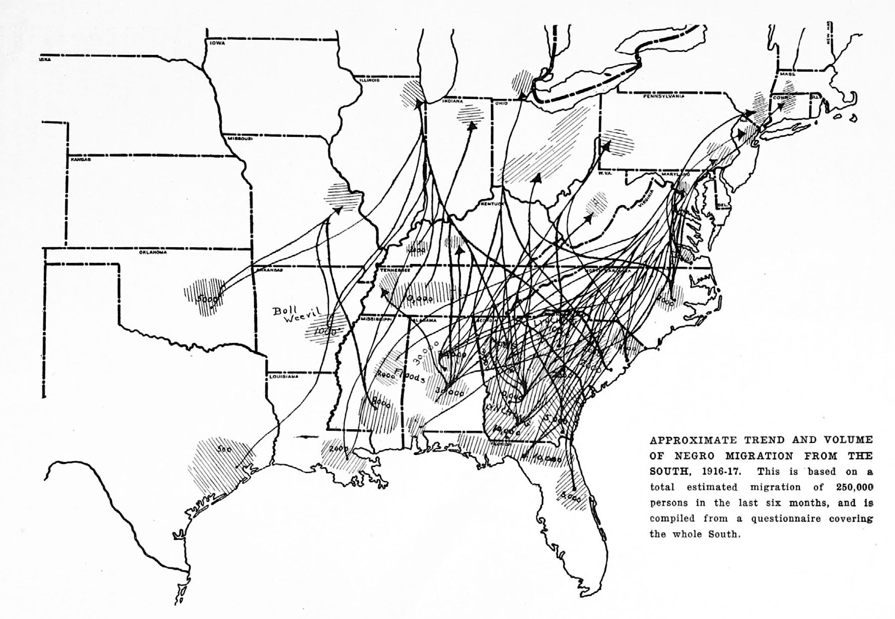

# The Migration of Negroes (1917)

Much has been written of the recent migration of colored people from the South to the North, but there have been very few attempts to give a definite, coherent picture of the whole movement. Aided by the funds of the National Association for the Advancement of Colored People, The Crisis has attempted to put into concrete form such knowledge as we have of this movement.

The data at hand are vague and have been collected from a hundred different sources. While the margin of error is large, the actual information which we have gathered is most valuable.

First, as to the number who have migrated to the North, there is wide difference of opinion. Our own conclusion is that about 250,000 colored workmen have come northward. This figure has been builded up from reports like the following which we take from various personal sources and local newspaper accounts:

> From Alabama, 60,000 able-bodied workers; from Savannah, Ga., 3,000; Montgomery, Ala., 2,000; West Point, Ala., 1,000; Americus, Ga., 3,000; Jefferson County, Ala., 10,000; West Point, Miss., 1,000; South Carolina, 27,000; West Point, Ga., 800; Macon, Ga., 3,000; Florida, 15,000; Notasulga, Ala., 3,000. From Abbeville, S. C., "by the hundreds all through the fall and winter." From Muskogee, Okla., "5,000 from the city and vicinity." One day "1,022 Negroes from the South came into Cincinnati." An estimate of the Boston, Mass., Transcript gives 200,000 immigrants. From Southwest Georgia, 5,000. Bradstreet's estimate: "An immense migration." From Birmingham, Ala., 10,000; Arlington, Ga., 500; Waycross, Ga., 900; Bessemer, Ala., 3,000; Columbus, Ga., 500; Tuscaloosa, Ala., 2,500; Dawson, Ga., 1,500. Immigrants to Springfield, Mass., 500; to Chicago, IIl., 50,000, and "coming in at the rate of 10,000 in two weeks," (estimate of the Chicago American).

As to the reasons of the migration, undoubtedly, the immediate cause was economic, and the movement began because of floods in middle Alabama and Mississippi and because the latest devastation of the boll weevil came in these same districts.

    

A second economic cause was the cutting off of immigration from Europe to the North and the consequently wide-spread demand for common labor. The U.S. Dpartment of Labor writes:

 > "A representative of this department has made an investigation in regard thereto, but a report has not been printed for general distribution. It may be stated, however, that most of the help imported from the South has been employed by railroad companies, packing houses, foundries, factories, automobile plants, in the northern States as far west as Nebraska. At the present time the U. S. Employment Service is not co-operating in the direction of Negro help to the north."

The third reason has been outbreaks of mob. violence in northern and southwestern Georgia and in western South Carolina.

These have been the three immediate causes, but back of them is, undoubtedly, the general dissatisfaction with the conditions in the South. Individuals have given us the following reasons for migration from certain points:

> Montgomery, Ala., better wages, lack of employment, bad treatment; West Point, Ala., boll weevil; Americus and Cartersville, Ga., lynching, schools, bad treatment, low wages; Birmingham, Ala., right to vote, discontent, bad treatment, low wages; Fairburn, Ga., low wages, bad treatment; Sanford, Fla., low wages, bad treatment; Anniston, Ala., low wages, bad treatment; Jefferson County, Ala., low wages, bad treatment; West Point, Miss., low wages; La Grange, Ga., low wages, bad treatment; Washington, Ga., low wages, schools; Newnan, Ga., low wages; Jackson, Ga., protection, schools; Covington, Ga., low wages; Montezuma, Ga., low wages, oppression; Tallahassee, Fla., unrest, conditions, low wages; Honeapath, S. C., low wages; Douglassville, Ga., bad treatment, poor schools; Raleigh, N. C., protection and the right to vote; West Point, Ga., boll weevil; Franklin, Ga., bad treatment and fear of lynching; Lithonia, Ga., low wages, bad treatment; Rome, Ga., injustice in the courts, low wages, lack of privileges, schools; Live Oak, Fla., low wages, bad treatment; Columbus, Ga., low wages, bad treatment; Atlanta, Ga., low wages; Jackson, Miss., low wages, bad treatment; Augusta, Ga., low wages, bad treatment; Nashville, Tenn., low wages; Meridian, Miss., low wages, discrimination; New Orleans, La., low wages; Mobile, Ala., low wages; South Atlanta, Ga., schools, freedom; Macon, Ga., low wages; Valdosta, Ga., unemployment, bad treatment: Cuthbert, Ga., bad treatment; Wadley, Ga., schools, civil rights; Gainesville, Ga., low wages, bad treatment.

 To this we may add certain general statements from colored leaders thoroughly conversant with conditions in their communities and in some cases with large parts of the South.

A colored man of Sumter, S. C., says: "The immediate occasion of the migration is, of course, the opportunity in the North, now at last open to us, for industrial betterment. The real causes are the conditions which we have had to bear because there was no escape."

These conditions he sums up as the destruction of the Negroes' political rights, the curtailment of his civil rights, the lack of protection of life, liberty and property, low wages, the Jim Crow car, residential and labor segregation laws, poor educational facilities.

From Oklahoma we learn that Negroes are migrating because of threatened segregation laws and mob violence.

A colored man from Georgia states: "In my opinion the strongest factor in this migration is a desire to escape harsh and unfair treatment, to secure a larger degree of personal liberty, better advantages for children, and a living wage."

The A. M. E. Ministers' Alliance of Birmingham, Ala., names seven causes for the migration: "Prejudice, disfranchisement, Jim Crow cars, lynching, bad treatment on the farms, the boll weevil, the floods of 1916."

A colored business man of North Carolina believes: "There is a silent influence operating in the hearts of the growing class of intelligent Negroes that the insurmountable barriers of caste unnecessarily fetter the opportunities to which every living soul is entitled, namely, a fair chance to earn an honest living and educate his children and be protected by the laws."

In many sections of Mississippi the boll weevil destroyed the cotton crop; rains and high waters in the spring destroyed other crops.

A well-known investigator reports: "Nothing else seemed left for hundreds of the colored tenants to do but to go into the cities or to the North to earn even their food. Nothing was left on the farms and the landowners could not or would not make any further advances. From the country and even from the cities in these unfortunate sections colored people have in many cases streamed northward."

The centres of this migration have been at Jackson, Hattiesburg, and Meridian, Miss., and many have sacrificed property in order to get away.

A widely-traveled and intelligent colored man writes:

 > "I recently made a trip through the South as far down as New Orleans, La., and I saw hundreds who were making their way northward. When in New Orleans, I learned that there were about 800 in the city from the inland district waiting to go, and who expected to leave during the next week. I went with a friend down where I could meet some of the leaders and talk with them. I met them, and they informed me that they were willing to go anywhere rather than continue to live like they had been. These were heading toward Chicago. I was shocked at the statement made by some of them as to how they lived on those big inland farms, and how badly they were treated by the whites. Many of these men were in overalls. I told them that they were unprepared for the climate; but they were willing to run any risk to get where they might breathe freer. Who blames them?"

Many of the southern whites, through their newspapers, are confirming this general unrest. A white woman says:

> "That which a regard for common justice, fair play, human rights could not accomplish, a fear for our bank account is doing, and we are asking: Why is the Negro dissatisfied? What can we do to keep him in the South? We can't afford to let him go; he means too much for us—financially. He works for little; his upkeep costs us little, for we can house him in any kind of shack, and make him pay us well for that; we do not have to be careful of his living conditions; he is good-natured, long-suffering, and if he should happen to give us trouble we can cope with that and the law will uphold us in anything we do."

The Columbia, S. C. *State* asks:
> "If you thought you might be lynched by mistake, would you remain in South Carolina? Ask yourself that question if you dare."

The Greenville, S. C., *Piedmont* feels that,

> "The truth might as well be faced, and the truth is that the treatment of the Negro in the South must change or the South will lose the Negro."

The Greenville, S. C., *News* says:

> "The Abbeville outrage may yet prove more of an economic crime than an offense against the peace and dignity of the state. Where is our labor to come from if not from these people who have lived here beside us for so many generations? Immigration has been a distinct failure in the South; it is expressly declared to be against the policy of South Carolina by our laws."

It is interesting to note that this migration is apparently a mass movement and not a movement of the leaders. The wave of economic distress and social unrest has pushed past the conservative advice of the Negro preacher, teacher and professional man, and the colored laborers and artisans have determined to find a way for themselves. For instance, a colored Mississippi preacher says:

> "The leaders of the race are powerless to prevent his going. They had nothing to do with it, and, indeed, all of them, for obvious reasons, are opposed to the exodus. The movement started without any head from the masses, and such movements are always significant."

The character of the people who are going varies, of course, but as the Birmingham, Ala., *Age-Herald* remarks:

> "It is not the riff-raff of the race, the worthless Negroes, who are leaving in such large numbers. There are, to be sure, many poor Negroes among them who have little more than the clothes on their backs, but others have property and good positions which they are sacrificing in order to get away at the first opportunity.    
& nbsp;
> "Various reasons are assigned for the migration of Negroes from the South to the North. It was believed for a while that they were lured away by the glowing reports of labor agents who promised high wages, easy work, and better living conditions. But there is something more behind their going, something that lies deeper than a temporary discontent and the wish to try a new environment merely for the sake of a free trip on the railroads... .     
& nbsp;     
> "The entire Negro population of the South seems to be deeply affected. The fact that many Negroes who went North without sufficient funds and without clothing to keep them warm have suffered severely and have died in large numbers, has not checked the tide leaving the South. It was expected that the Negroes would come back, sorry that they ever left, but comparatively few have returned. With the approach of warmer weather the number going North will increase."

How great this migration will eventually prove depends upon a number of things. The entrance of the United States into the war will undoubtedly have some effect. When the war ends it is doubtful if the labor shortage in Europe will allow a very large migration to the United States for a generation or more. This will mean increased demand for colored laborers in the North. A writer in the New York *Evening Globe* predicts that 1917 will see 400,000 of the better class of Negro workers come to the North.

At any rate, we face here a social change among American Negroes of great moment, and one which needs to be watched with intelligent interest.

______________
*Citation:* Du Bois, W.E.B. 1917. "The Migration of Negroes." *The Crisis*. 13(4):63-66.
