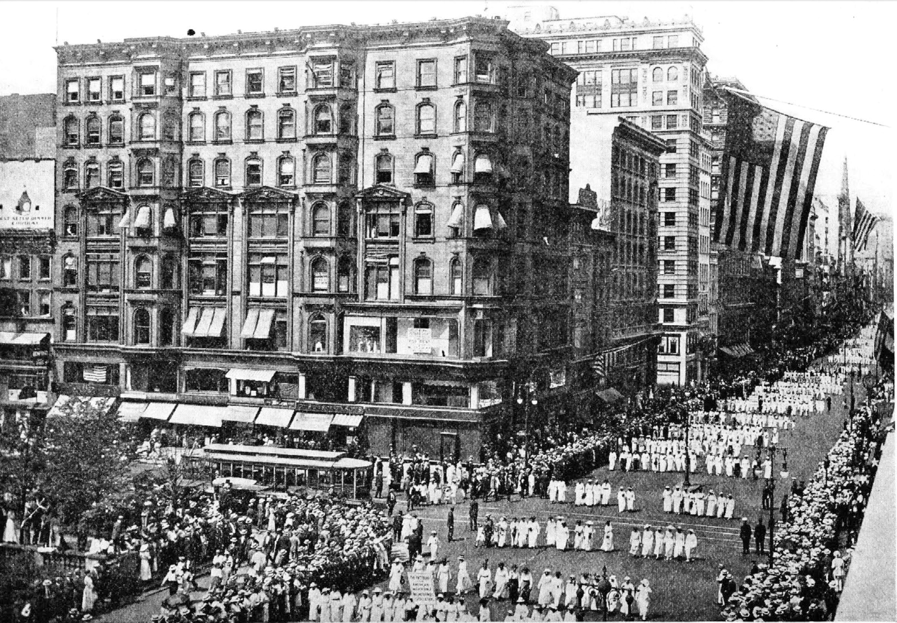

<!--
title:   The Negro Silent Parade
author:  National Association for the Advancement of Colored People
journal: The Crisis
year:    1917
volume:  14
issue:   5
pages:   241-244
-->
# The Negro Silent Parade (1917)

On the afternoon of Saturday July 28, a vast body of Negroes marched through the streets of New York in silent protest against the recent race riots and outrages. The *New York American* says:

> In silent protest against the recent killing of Negroes in race riots in Waco, Memphis and East St. Louis, 15,000 Negroes marched here yesterday afternoon. The parade formed in Fifth avenue and marched from Fifty-seventh street to Madison Square.   
> &nbsp;  
> Placards carried by boy scouts, aged men and by women and children explained the purpose of the demonstration.

A detailed account of the causes for which the parade was held is given as follows by the *New York Times*:     

> During the progress of the march circulars were distributed among the crowds telling of the purpose which brought the Negroes together. Under the caption, "Why Do We March?" the circular read, in part, as follows:    
> &nbsp;  
> We march because by the grace of God and the force of truth the dangerous, hampering walls of prejudice and inhuman injustices must fall.   
> &nbsp;   
> We march because we want to make impossible a repetition of Waco, Memphis. and East St. Louis by arousing the conscience of the country, and to bring the murderers of our brothers, sisters and innocent children to justice.      
> &nbsp;   
> We march because we deem it a crime to be silent in the face of such barbaric acts.   
> &nbsp;  
> We march because we are thoroughly opposed to Jim Crow cars, etc., segregation. discrimination, disfranchisement, lynching, and the host of evils that are forced on us. It is time that the spirit of Christ should be manifested in the making and execution of laws.    
> &nbsp;  
> We march because we want our children to live in a better land and enjoy fairer conditions than have fallen to our lot.    
> &nbsp;    
> We march in memory of our butchered dead, the massacre of honest toilers who were removing the reproach of laziness and thriftlessness hurled at the entire race. They died to prove our worthiness to live. We live in spite of death shadowing us and ours. We prosper in the face of the most unwarranted and illegal oppression.    
> &nbsp;  
> We march because the growing consciousness and solidarity of race, coupled with sorrow and discrimination, have made us one; a union that may never be dissolved in spite of shallow-brained agitators, scheming pundits and political tricksters who secure a fleeting popularity and uncertain financial support by promoting the disunion of a people who ought to consider themselves as one."   

Although the paraders marched by in silence their sentiments were proclaimed by many mottoes, a complete list of which follows:

> Memphis and Waco—Centers of American Culture?"   
> &nbsp;     
> Alabama needs 75,000 Ballots to elect 10 Congressmen. Minnesota needs 300,000. How do they do it?"     
> &nbsp;     
> 350,000 voters in the South have as much political power as the 1,500,000 voters of New York State. How do they do it?"     
> &nbsp;     
> Each white man in the South by disfranchising the black working man casts from 3 to 13 times as many ballots as You."      
> &nbsp;     
> Georgia and New Jersey have the same vote for President. Georgia casts 80,000 votes; New Jersey casts 430,000."      
> &nbsp;     
> Make America safe for Democracy."      
> &nbsp;     
> Taxation without representation is tyranny."      
> &nbsp;     
> Thou shalt not kill."      
> &nbsp;     
> Thou shalt not bear false witness against thy neighbor."      
> &nbsp;     
> We hold these truths to be self-evident that all men are created equal. That they are endowed by their Creator with certain unalienable rights. That among these are LIFE, LIBERTY and the pursuit of HAPPINESS."      
> &nbsp;     
> If you are of African descent tear off this corner."      
> &nbsp;     
> America has lynched without trial 2,867 Negroes in 31 years and not a single murderer has suffered."       
> &nbsp;     
> 200,000 black men fought for your liberty in the Civil War."        
> &nbsp;     
> The first blood for American Independence was shed by a Negro—Crispus Attucks."        
> &nbsp;     
> We have fought for the liberty of white Americans in 6 wars; our reward is East St. Louis."       
> &nbsp;     
> 12,000 of us fought with Jackson at New Orleans."   
> &nbsp;

  
**The Negro Silent Parade, at Forty-Second street and Fifth avenue, New York City.**  *C.T Adams.*

> We fought with Perry at Lake Erie."        
> &nbsp;     
> 10,000 of us fought in the Spanish American War."        
> &nbsp;     
> From Bunker Hill to Carrizal we have done our bit."        
> &nbsp;     
> The world owes no man a living, but every man an opportunity to earn a living."        
> &nbsp;     
> We are maligned as lazy and murdered when we work."        
> &nbsp;     
> We are excluded from the unions, and condemned for not joining them."        
> &nbsp;     
> Repelled by the unions we are condemned as scabs."        
> &nbsp;     
> They refuse us opportunity, then deny our capacity.
> &nbsp;

   
```{margin}
Du Bois is in the second row, second from the right, marching next to James Weldon Johnson.
```
    
**The Negro Silent Parade, Fifth avenue, New York City.**  *Underwood & Underwood.*

> Suffer little children and forbid them not."       
> &nbsp;     
> Unto the least of these my brethren."       
> &nbsp;     
> 3,000 Negroes fought for American Independence under George Washington."       
> &nbsp;     
> We helped to plant the flag in every American Dominion."       
> &nbsp;     
> Were we first in France? Ask Pershing."        
> &nbsp;     
> Thirty-four Negroes have received Carnegie hero medals."        
> &nbsp;     
> Our music is the only American music."        
> &nbsp;     
> Give us a chance to live."        
> &nbsp;     
> So treat us that we may love our country."        
> &nbsp;     
> Interpret for us in living, loving acts, the religion of Jesus Christ."        
> &nbsp;     
> India is abolishing caste; America is adopting it."        
> &nbsp;     
> Race prejudice is the offspring of ignorance and the mother of lynching."        
> &nbsp;     
> If fault is to be found with color, blame God and yourselves."        
> &nbsp;     
> Not alms but OPPORTUNITY."        
> &nbsp;     
> Patriotism and loyalty presuppose protection and liberty."        
> &nbsp;     
> We have 1,000,000 farmers."        
> &nbsp;     
> We have 30,000 carpenters."        
> &nbsp;     
> We have 30,000 clergymen."        
> &nbsp;     
> We have 12,000 brick and stone masons."        
> &nbsp;     
> We have 30,000 teachers."        
> &nbsp;     
> We have 3,000 physicians."        
> &nbsp;     
> We own 250,000 farms with 20,000,000 acres of land worth $500,000,000."        
> &nbsp;     
> We have church property worth $76,000,000."   
> &nbsp;     
> A square deal for every man."—T. R.        
> &nbsp;     
> The Negro has never betrayed the flag, attempted to assassinate the President or any official of this government."        
> &nbsp;     
> We have 60,000 iron and steel workers."    
> &nbsp;     
> We have 20,000 slaughter and packing house operators."        
> &nbsp;     
> No land that loves to lynch 'n******' can lead the hosts of Almighty God."     
> &nbsp;     
> Put the spirit of Christ in the making and execution of laws."     
> &nbsp;     
> Your hands are full of blood."     
> &nbsp;     
> Mother, do lynchers go to heaven?"       
> &nbsp;     
> Cain, where is Abel, thy brother?"       
> &nbsp;     
> The great contradiction—love of God and hatred of man."       
> &nbsp;     
> Color, blood and suffering have made us one."        
> &nbsp;     
> Pray for the Lady MacBeths of East St. Louis.

The New York *World* says:

> The Rev. Dr. H. C. Bishop was President of the parade. The Rev. Dr. Charles D. Martin was Secretary. The Rev. F. A. Cullen was Vice President. The first Deputy Marshal was J. Rosamond Johnson. Others were A. B. Cosey, C. H. Payne, formerly a member of Troop A, Ninth Cavalry; the Rev. E. W. Daniels, Allen Wood, James W. Johnson and John Nail. Jr.        
> &nbsp;     
> Rev. G. M. Plaskett and Dr. W. E. B. Du Bois were in the line of officers.

______________
*Citation:* National Association for the Advancement of Colored People. 1917. "The Negro Silent Parade." *The Crisis*. 14(5):241&ndash;244.