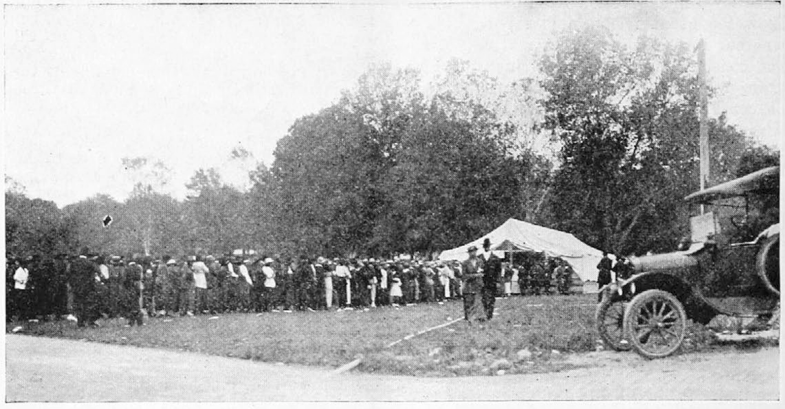
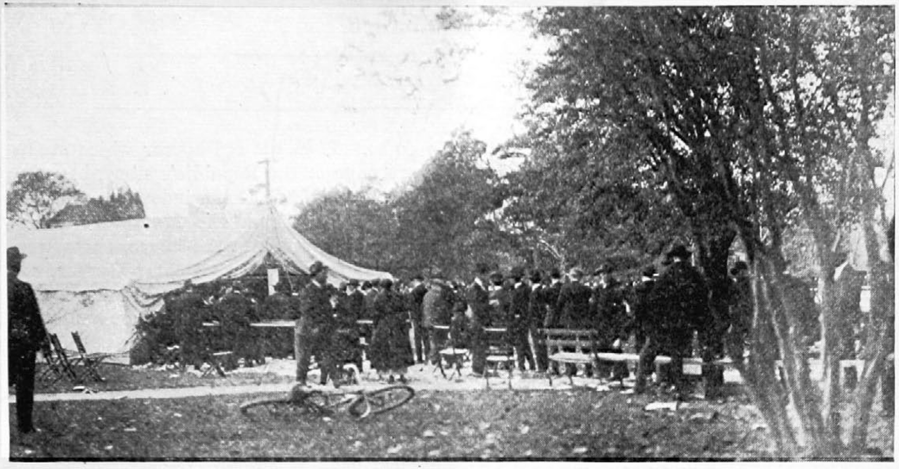

<!--
title:   Election Day in Florida
author:  White, Walter F.
journal: The Crisis
year:    1920
volume:  21
issue:   3
pages:   106-109
-->
# Election Day in Florida (1920)

An unknown number of dead, men of property and standing forced to leave their homes and families under threat of death, thousands of qualified voters debarred from casting their ballots---these constitute a portion of the results of the elections of 1920 in the state of Florida. To that list might well be added an increased bitterness on the part of both white and colored people towards each other and another black mark entered in the books of colored people against the whites for what the former had to suffer. 

It is not possible to write of race relations in the South today without giving due prominence to the revival of that sinister organization, the Ku Klux Klan. There is hardly a town or community to be found which does not have its branch. Certain it is that wherever one goes in the South one hears of the "Klucks" and what that order is going to do to maintain "white supremacy". Clothed in great secrecy and hinting of dire things to come, the pretensions of the noble "protectors of southern womanhood" would be ludicrous were it not for the vicious deeds already performed by branches in some of the smaller towns and rural communities. If one looks at the Ku Klux Klan solely from the viewpoint of the larger cities of the South like Jacksonville, Atlanta and Birmingham where the Negro population is concentrated in certain sections, the efforts of the Klan are pathetically amusing and are treated as such by colored people. Forty years ago when the original Ku Klux did effective work in terrorizing, murdering and pillaging the Negroes of the South it was dealing with four million recently emancipated slaves with all of the characteristics following in the wake of two and a half centuries of human bondage. They were ignorant, superstitious, easily frightened, poorly organized, distrustful of each other and still believing that they were inferior to white men. It was a comparatively simple matter to envelop the Klan with a cloak of supernatural power and to send a colored man shivering to cover until a parade had passed. 

Today, however, the setting is changed. 

 A new generation of Negroes has arisen with thousands of university, college, high school and grammar school graduates among them; possessing property and the respect for self that accompanies such possessions. I have talked with many Negroes and with many white men in the South. I have found a far higher order of intelligence among Negroes than among whites, when one compares the two races grade for grade. In regard to the Klan, even the uneducated Negro looks upon it with amused contempt. His white brother, in most cases, cherishes a fatuous belief common to provincial and circumscribed minds that terroristic methods will be efficacious in "keeping the nigger in his place."

In Jacksonville, for example, a parade of the local Klan was held on Saturday night, October 30. Large numbers of colored people turned out to view the parade. One old colored woman of the antebellum type that is fast disappearing, called out derisively to the marching Klucks: 

> White folks, you ain't done nothin'. Them German guns didn't scare us and I know them white faces ain't goin' to do it now.

That remark epitomizes the feeling. Phrased in better English it likewise expresses the sentiment among the larger number of educated colored citizens of Jacksonville. But beneath the amused tolerance there is a grim realization that the Klan will not spend its energy in marching---that the sinister purposes of the movement betoken no good to colored people. Negroes are prepared for trouble in every part of the South where I have been. They realize that they are outnumbered and outarmed and that death is the inevitable fate of many if clashes come. 

The situation in the smaller towns and isolated rural communities where the Negro population is widely scattered is of a more serious nature. There the Klans can wreak their vengeance on any Negro who dares offend them by being too prosperous or being suspected of some crime, great or small, or by incurring the displeasure of any white man of the community. This vengeance extends to white men who offend some loyal member of a Klan or who dares show too great friendliness for Negroes---whether for selfish or other motives. It is not considered improper but just the contrary for a white man or boy to debauch or consort with a colored woman, but no white man can treat a Negro as an equal, As a case in point read a Klan warning sent to a prominent white lawyer of a Florida town who advised Negroes to qualify, register and vote in the recent election. It reads: 

> We have been informed that you have been telling Negroes to register, explaining to them how to become citizens and how to assert their rights.    
> &nbsp;    
> If you know the history of reconstruction days following the Civil War, you know how the "scalawags" of the North and the black republicans of the South did much as you are doing to instill into the Negro the idea of social equality. You will remember that these things forced the loyal citizens of the South to form clans of determined men to maintain white supremacy and to safeguard our women and children.     
> &nbsp;    
> And now you know that history repeats itself and that he who resorts to your kind of a game is handling edged tools. We shall always enjoy WHITE SUPREMACY in this country and he who interferes must face the consequences.    
> &nbsp;    
> GRAND MASTER FLORIDA KU KLUCKS. 
> &nbsp;    
> Copy     
> Local Ku Klucks     
> Watch this man.     

An example of what can be done and what has been done in a small town is the election riot at Ocoee, Orange County, Florida. For weeks before November 2, word had been sent to the Negroes that no colored man would be allowed to vote. The statement was emphasized with the threat that any Negro attempting to cast his ballot would be severely punished. One colored man disregarded the warning. He was the most prominent man in his community, owned a large orange grove worth more than ten thousand dollars, his own home and an automobile. He had always borne the reputation of being a safe and sane leader among his people and had never been involved in trouble of any kind. And therein lay his unpopularity. He was too prosperous---"for a nigger". He, Mose Norman, attempted to vote. He was beaten severely and ordered to go home. The press reports stated later that he had not paid his poll tax nor had he registered. On this point and the succeeding events, may I quote the statement of a white man of the town who said:

> … he was denied upon the ground that he had not paid his poll tax, when, as a matter of fact, the records of this county (if they have not been doctored since) will show that he had paid his tax. The press claimed that he made a threat that he was going home to get his gun, and see that he did vote. I do not believe that anyone, situated as he was, would have been foolhardy enough to make such a threat. After the polls closed, a number of armed men went to his house, without a warrant and without authority of law as is claimed by those approving their action, to arrest this Negro. Two white men were shot in the Negro's backyard. From that time on for three days the community ran riot. I do not believe it will ever be known how many Negroes were killed. Every Negro home, schoolhouse, church and lodge-room in that community was burned, in some instances with women and children occupying the houses, and thus burned to death. … The foregoing is a fair sample of conditions which exist in most parts of the state.

The story is essentially as told above. When Norman left the polls he went to the home of July Perry, another colored man, who likewise was unpopular with the whites in that he was foreman of a large orange grove owned by a white man living in New England---a job which the community felt was too good for a Negro. When the mob attacked the colored community the colored people fought in self-defense, killing two white men and wounding two, according to news accounts. Citizens of the town told me that eight or ten whites were killed but that they could not allow the information to become known, fearing the effect on the colored population. However, the mob surrounded the settlement, set fire to it, shot down or forced back into the flames colored men, women and children who attempted to flee. The number murdered will probably never be known. The figures generally given varied from thirty-two to thirty-five. One lean, lanky and vicious looking white citizen of Ocoee of whom I asked the number of dead, replied: 

> I don't know exactly but *I know fifty-six niggers were killed. I killed seventeen myself.*

Whatever the number, two of those known to have died, *were a colored mother and her two-weeks old infant.* Before the ashes of the burned houses had cooled, eager members of the mob rushed in and sought gleefully the charred bones of the victims as souvenirs. As I stood on the spot approximately seventy-two hours following the slaughter, the remains looked as though 
some one had gone over them with a fine-toothed comb. 

An amazing aftermath of the occurrence was the attitude of the white inhabitants of Orange County. Talking with numbers of them, the opinion of the majority seemed to be that nothing unusual had taken place---that the white people had acquitted themselves rather meritoriously in checking: unholy and presumptuous ambitions of Negroes in attempting to vote. Even the white children of Ocoee felt that an event, similar in enjoyment to a circus had taken place. One bright-faced and alert girl of eleven when asked what had occurred, told happily of how "we had some fun burning up some niggers". There was no thought of horror at the deed---it was accepted as a matter of course. 

Some of the methods used in the smaller towns in eliminating the Negro vote and particularly the colored woman vote were unique. In Orange and Osceola counties, a colored woman would attempt to register; on being asked her age, for example, she would say twenty-four. She would then be asked the year in which she was born. Many of them being illiterate, would not know. The registrar would then probably say, "If you are twenty-four, you were born in 1892, weren't you?" The applicant, seeking to get the ordeal over, would reply in the affirmative. Before she had been away from the place very long a warrant for perjury had been sworn out against her and she had Seen arrested. I found many cases equally as flagrant where Negro women had been imprisoned for such "offenses" as these. 

In the same manner men would be intimidated and threatened. A white lawyer told me laughingly of how a Negro would approach a registration booth in his county, Orange, and ask if he could register. The officials there, in most cases of the poorer order of whites, would reply, "Oh, yes, you can register, but I want to tell you something. Some god damn black is going to get killed about this voting business yet." 

In Quincy, Gadsden County, the leading colored man of the town, a physician, owner of a drug store and other property including an excellent home, on election day was surrounded as he approached the polling booth to cast his ballot, by a crowd who spat in his face and dared him to wipe his face. His "crime" was that of advising colored men and women to register and vote. He has since been ordered to get out of the town but remains---determined to die rather than submit. He has always been a good citizen and highly respected by both white and colored people. 

Two brothers of Live Oak, Suwanee County, who also were good citizens, prosperous and the owners of a large merchandise business, were called from their homes two weeks before election day, beaten almost to death and ordered to leave town immediately for the same offense of urging Negroes to vote. One has gone, the other lies at the point of death from a stroke of paralysis brought on by the beating. 

Nor are these isolated cases but rather are they typical of what took place in many parts of the state. The West Palm Beach *Post* of October 30 carried an article with the significant statement, "Sheriff R. C. Baker will have several deputy sheriffs at the polls to arrest black violators of the election laws as fast as they appear and ask for ballots." The inference is that only Negroes violated the election laws while it is generally known that white Democratic voters openly carried memoranda into the booths, which is directly contrary to law. Only Negro Republicans were arrested for this violation. 

    
***The Sixth Ward polling-tent, Jacksonville, Florida, colored side. Line during entire day.***

In Jacksonville, where Negroes form slightly more than half of the population of 90,000, the situation was different. In spite of parades of the Ku Klux Klan, vicious newspaper propaganda designed to intimidate Negro voters, and the announcement two days before election that 4,000 warrants had been sworn out in blank form for the arrest of Negroes, the colored vote turned out *en masse*. Most of the colored people live in the second, sixth, seventh and eighth wards. An active campaign was carried on after the passage of the suffrage amendment which resulted in the registration of more colored than white women in all four of the wards. Frantic stories threatening domination by "Negro washerwomen and cooks" failed to bring out the white women to register. To the number of women was added the large registration of men, white and colored, in the spring of 1920. Yet, in the second, seventh and eighth wards the total vote did not equal the registration of colored women alone, while in the sixth ward the total number of votes cast was only a few more than the number of women, white and colored, registered. Every possible effort was made to hamper the voting of Negroes. The polling places were arranged with four entrances---one each for white women, white men, colored women and colored men. No delay was caused to white voters. More than four thousand colored men and women, whose names, addresses. and registration certificate numbers are in the hands of responsible colored citizens of Jacksonville, stood in line from 8:00 A.M., the hour of opening, to 5:40 P.M., the hour of closing the polls, and were not allowed to vote. 

    
***Same polling-tent, white side. 75 in line at 12:40 P.M.*** *There were 1569 colored women alone registered in this ward and yet only 2633 votes in all were reported.*

Unless the problem of the ballot is solved, either through reduction of Southern representation, a force bill or by some other means, and the entire problem of race relations solved through clear thinking and just dealing, our race riots and similar disturbances are just beginning. This may sound pessimistic and as though the problem were viewed only from the standpoint of an alarmist. That is not the case. It is based upon the innermost feelings and thoughts of twelve million Americans who seek to be free. 

______________

*Citation:* White, Walter F. 1920. "Election Day in Florida." *The Crisis*. 21(3):106&ndash;109.