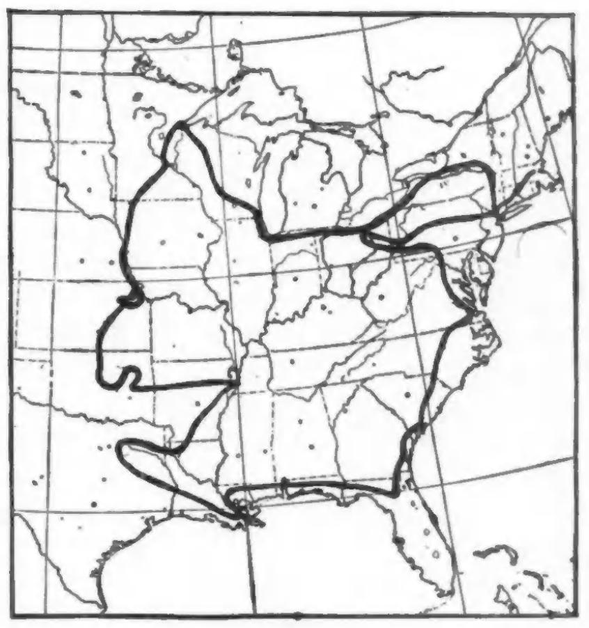

<figure class="right" style="width: 50%;">
{width=100%}
<figcaption>
Journey of Dr. Du Bois from Fitchburg, Mass., by way of Charleston, New Orleans, Oklahoma and Duluth to New York---7,000 miles with 38 lectures before audiences aggregating 20,000 people.
</figcaption>
</figure>

I have been journeying seven thousand miles: from Bunker Hill to Pittsburg and the Valley of the Shadow of Steal; from Hampton Roads to Fort Sumter, and from the Oranges of Florida to New Orleans. I have seen the Father of Waters from mouth to source, together with the Oil Bungalows of Oklahoma, the Sands of Texas and the Winds of Kansas. Bull, Palafox and State Streets, Canal, West Broad and Beale Avenue, have guided my feet. I have felt the Spring blushing in Louisiana and seen the Snow flying in Duluth. But through all these minor things have loomed faces: dark, wistful faces; eyes sweet with pain; and ears full of loud laughter; cosy homes, lynching, lovely children, “Jim Crow” cars (4,000 miles and 5 white nights in them), slave-songs and the snarl of human beasts---hope, caste, wealth, slavery, grit and despair in 20,000 souls whose eyes met mine in doubt and silent questioning, in sudden sympathy and tears. Seven thousand miles in Afro-America and four thousand of them “Jim-Crowed”. I have tales to tell.

<!-- Similar articles start here -->

#### Related Articles

* [Westward Ho (1934)](/Volumes/41/05/westward_ho.html)
* [I Go A-Talking (1913)](/Volumes/06/03/i_go_a_talking.html)
* [Progress (1920)](/Volumes/21/01/progress.html)
* [Light (1912)](/Volumes/03/04/light.html)
* [A Crusade (1914)](/Volumes/07/05/crusades.html)

<!-- Similar articles end here -->