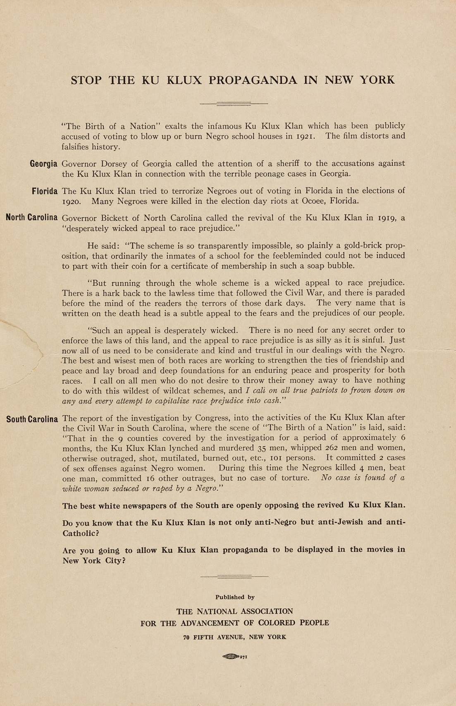

<!--
title:   Libelous Film
author:  Du Bois, W.E.B.
journal: The Crisis
year:    1921
volume:  22
issue:   3
pages:   102
-->

# Libelous Film (1921)

```{margin}
     
NAACP flyer. 
```

Last month "The Birth of a Nation" with its cruel and indefensible libel of the Negro and glorification of the mob in the Ku Klux Klan was revived in several eastern cities. In Boston it was suppressed; in New York the N.A.A.C.P. planned a public protest. We secured former service men and women Y.M.C.A. secretaries who had served abroad, to march before the Capitol Theatre and distribute bills and carry placards. They were arrested. The first judge was vociferous and wanted to charge them with inciting riot. The second judge was calmer and offered to let them go if they would promise not to do it again. This they refused to do and were released on suspended sentence. They appealed the case. The names of these public servants are: Mrs. Helen Curtis, Mrs. Laura Jean Rollock, Miss Katherine Johnson, Edward F. Frazier and Llewelyn Rollock. 

_________________
*Citation:* Du Bois, W.E.B. 1921. "Libelous Film." *The Crisis*. 22(3):102.