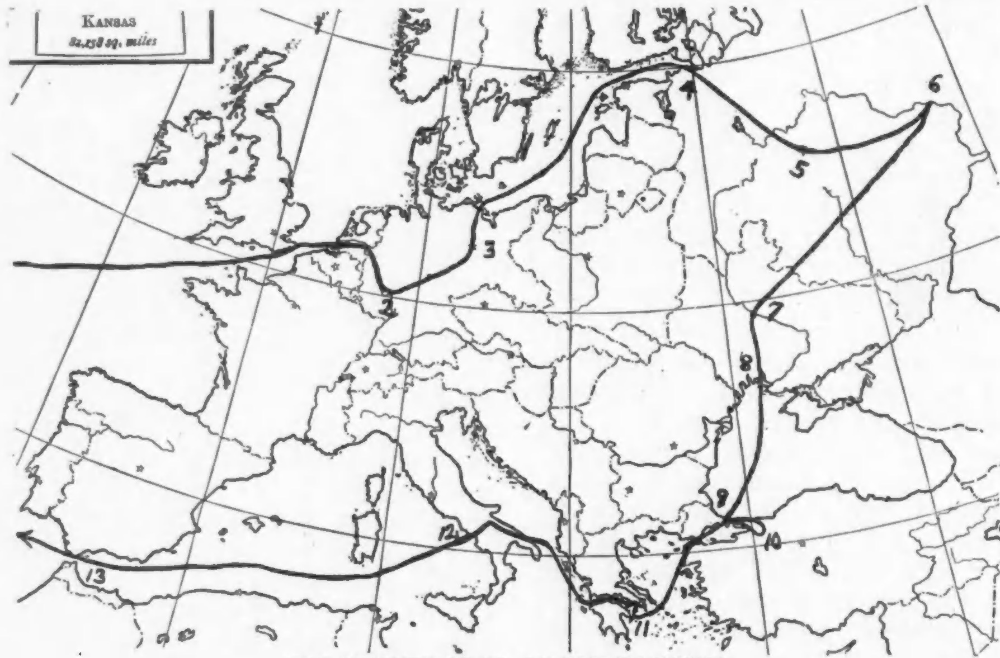

<!--
title:   Eugene Debs
author:  Du Bois, W.E.B.
journal: The Crisis
year:    1926
volume:  33
issue:   2
pages:   63-65
-->

# Eugene Debs (1926)

It was a brilliant idea when the Walker Manufacturing Company conceived the free trip around the world method of advertising. They have sent now for the third year groups of from four to six popular persons traveling over Europe and Asia and in so doing they have impressed upon certain of our leading citizens the fact that problems of race and color are problems of the world and not simply of the United States.

It has been for the purpose of realizing and teaching this fact that I have visited the old world eight times. First, in my young manhood to Germany on a fellowship. Second, to the Paris Exposition at my own expense. Third, to England and Scotland through the gift of an English friend. Fourth, to the Races Congress at the expense of the National Association for the Advancement of Colored People and John E. Millholland. Fifth and sixth, to the First and Second Pan-African Congresses at the expense of the National Association for the Advancement of Colored People. Seventh, to the Third. Pan-African Congress at the expense of the Circle for Negro War Relief, then a committee of the N.A.C.W. 

My recent trip I had planned for revisiting Germany and I had hoped to pay for it by certain lectures in Switzerland and Germany and by magazine articles in the United States. Just before I started an American citizen of Russian descent offered to pay the expense if I would go to Russia. I replied: 

 > I am not at all satisfied with the knowledge that I have of the Russian revolution. I should like to learn, if possible, at first hand just what has taken place in Russia and just what the development is at present. I do not know that I could learn anything that would be of advantage to the colored people of the United States, but if there is anything to learn I am eager to learn it. On the other hand, in undertaking this or any other trip I should not want to obligate myself to come to any particular conclusions or to follow any line of action or to see the facts with any other eyes except my own.

My friend accepted these conditions and I went to Russia. 

***THE JOURNEY OF DR. DU BOIS TO RUSSIA 2. Franfort-on-Main, 3. Berlin, 4. Leningrad, 5. Moscow, 6. Nijni Novgorad, 7. Kiev, 8. Odessa, 9. Constantinople, 10. Skutari, 11. Athens, 12. Naples, 13. Gibraltar.***

 <h2>My Recent Journey</h2> 

I went to Antwerp to see Rubens. Then I ascended the Rhine looking at the great vaulted cathedral at Cologne, at the Lorelei, at the Rheinfels, glancing at the old street of the Jews in Frankfort. I went up into the Thuringian forest where I first learned to know the old world and its culture, a quarter century ago. Then I saw Berlin, that giant city which has become since the day I knew it one of the few centers of the world. Taking a little boat at Stettin I sailed three days through the Baltic and the Gulf of Finland until I came to the city that was once St. Petersburg and to the street which was once the Nevski Prospeckt. I saw the dark red mass of the Winter Palace and went out to the gorgeous park that was once the Czar's village, (Tsarskoe-Selo) and is now called by the Bolsheviks---the Children's village,---happy word! Staying here but a few days I went on to Moscow where I lived a month. My home was in Revolution Square where I could look upon the walls of the Kremlin. A few steps brought me to Red Square and the Mausoleum of Lenin. I wandered into all the nooks and crannies of the city unattended. Not being an official visitor, I met few officials and did not join the excursions arranged for foreigners. 

But after all, Moscow is bureaucracy. Real Russia lies outside. I had always wanted to see Nijni Novgorod, far out on the Volga. I wanted to see the Ukraine. Then at Kiev, I started to return through Poland and Berlin, but scanning my geography I figured out a bit of almost impossible romance at no greater cost, and said to myself, "Why not return by the Black Sea and Constantinople and Greece, Naples and Gibralter?" I hesitated. It seemed almost fantastic and yet at last I ventured. I did it. 

But always the center of all this was Russia, and of Russia I have much to tell in days to come. 

________________

*Citation:* Du Bois, W.E.B. 1926. "Eugene Debs." *The Crisis*. 33(2):63&ndash;65.