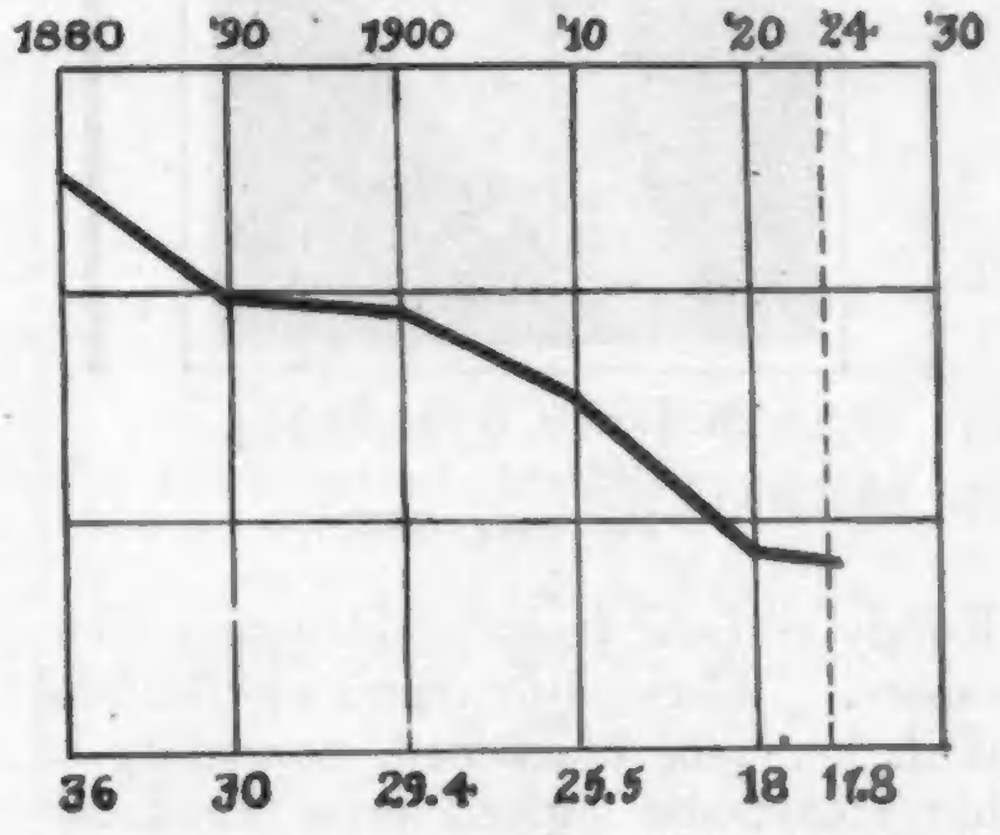

<!--
title:   Death Rates
author:  Du Bois, W.E.B.
journal: The Crisis
year:    1927
volume:  34
issue:   8
pages:   276
-->
# Death Rates (1927)

The difficulty about nearly all statistical matter with regard to the Negro in the United States is the rather astonishing habit which we have of comparing all our figures with similar figures relating to whites. In most cases the comparisons are misleading because the groups are not at all similar. Here is a great mass of white people, aided by large immigration in the past and considerable in the present, with the advantage of hospital service, trained physicians, sanitary homes and selected areas for the richer classes. There. is neither sense nor illumination in comparing the death rate of that group with the death rate of American Negroes, only a generation removed from slavery, under great mental and physical stress by reason of prejudice and migration, and under severe economic pressure.

    
*Negro death rate per 1,000 living, U.S.A.*

The group can only be compared with its own status in the past, to note progress; and such a comparison shows that the Negro death rate has been reduced 50 per cent. in the last forty years. The Negro has reduced his infant mortality and his death rate from scurges like tuberculosis. His betterment in health has been most striking and encouraging, as Louis I. Dublin, statistician of the Metropolitan Life Insurance Company, proves in the September *American Mercury*. Of course, there is still room and need for improvement, but the present American Negro death rate is as low as that of most European countries and considerable lower than that of Spain, Hungary, Russia, and the countries of South America.

_________________
*Citation:* Du Bois, W.E.B. 1927. "Death Rates." *The Crisis*. 34(8):276.
