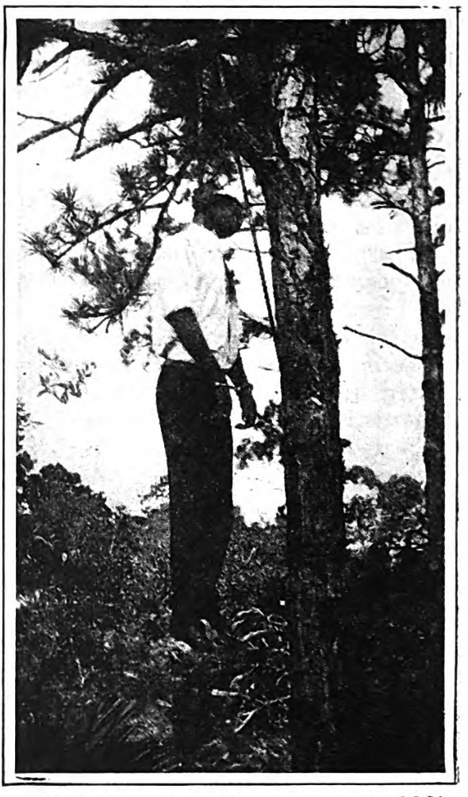

{width=40% .right}

In the annual address to the country issued by the N.A.A.C.P., we congratulated the United States because one period of one hundred and twenty days passed without a Negro being lynched. It seems that after all we were wrong. Here is the photograph of a man lynched in Florida "sometime during the latter part of February or the first of March". The snapshot was taken by a travelling salesman who had the film developed at Melbourne, Alabama, and then gave a copy to a colored police officer. We have been able to get no further information. We do not know what the name of the man who was lynched was or of what he was accused. He is evidently a well-dressed person and the hand-cuffs on his wrists show that he was in the custody of the officers of the law when murdered.

<!-- Similar articles start here -->

#### Related Articles

* [Peonage (1916)](/Volumes/11/06/peonage.html)
* [Crime and Lynching (1912)](/Volumes/03/03/crime_and_lynching.html)
* [Lynchings (1932)](/Volumes/39/02/lynchings.html)
* [Lynchings and Mobs (1921)](/Volumes/22/04/lynchings.html)
* [Lynching (1914)](/Volumes/07/05/lynching.html)

<!-- Similar articles end here -->