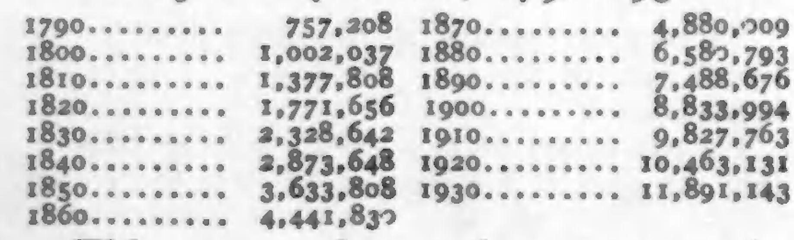
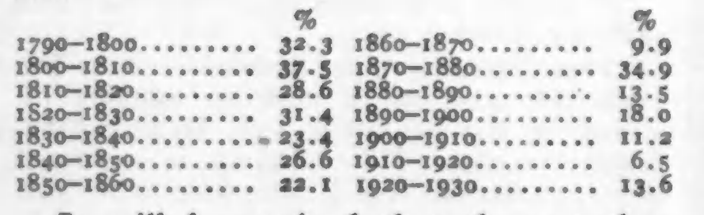
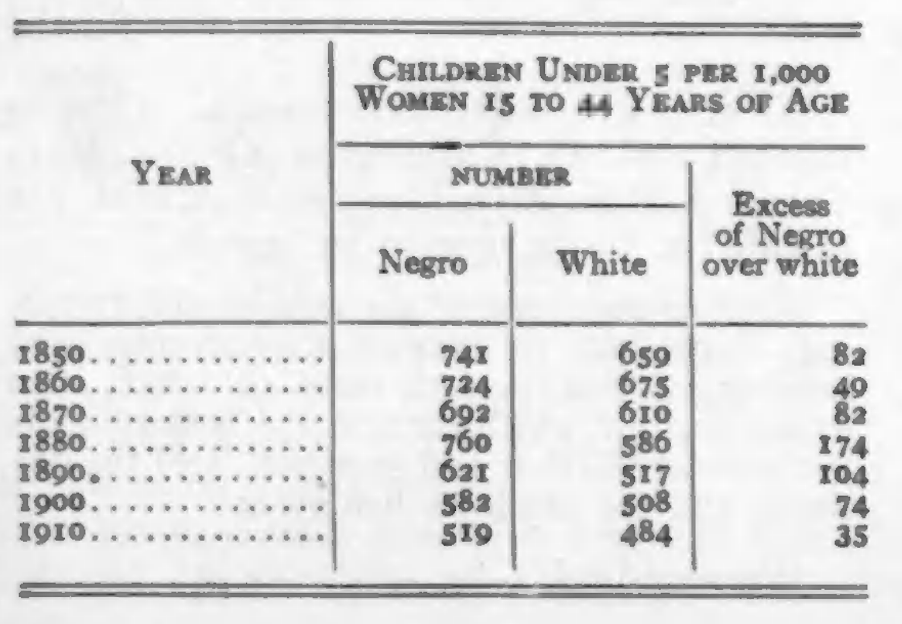

<!--
title:   Our Rate of Increase
author:  Du Bois, W.E.B.
journal: The Crisis
year:    1933
volume:  40
issue:   2
pages:   44
-->
# Our Rate of Increase (1933)

The  growth of the Negro  population in the United States has been an astonishing phenomenon, especially when we remember that in 1790, when there were only three-fourths of a million Negroes in the country, it was the generally accepted fact that without a slave trade Negroes could not survive. What happened was that slaves without a slave trade became more valuable and with cotton culture their value rose still further, so that they were fed adequately and their breeding systematically encouraged. The result was that the Negro population has increased as follows:

*Negro Population, 1790--1930*

 This means that each ten years the rate of increase of the Negroes has been:

It will be noticed that the rate has decreased. Just how much it has decreased, we do not know. The census figures are evidently inaccurate. The increase was smaller between 1860--1870 than between 1850--1860, but it was hardly reduced 50%; and so again the increase between 1910--1920 is officially reported as 6 1/2%, a ridiculous figure. In fact, in most states where Negroes live, accurate birth statistics are not kept. The only figures that give any true picture of our birth rate are the following, and they go only to 1910:

It is however clear that our birth rate is falling, just as the birth rate of all civilized peoples. It is probably falling faster in our case because of migration and the economic stress of the last few years. Our solicitude, however, is not for the number of children, but their quality, their health, the provision for their upbringing and education. Most of our increase today comes from the thoughtless peons of the black belt, while the better educated and most prosperous city groups are not reproducing themselves. This must be changed and careful thought and guidance given to the increase of the Negro race, particularly in quality.

_________________
*Citation:* Du Bois, W.E.B. 1933. "Our Rate of Increase." *The Crisis*. 40(2):44.