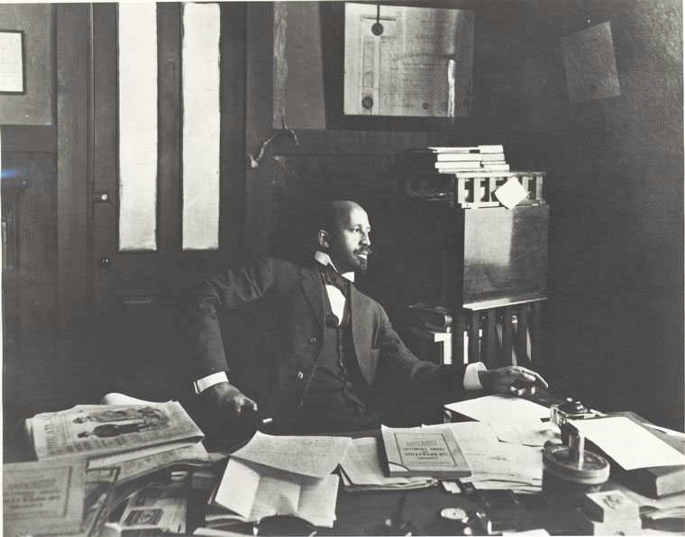

# Dare You Fight


This book is an ongoing project to make available a selection of works by W.E.B. Du Bois that appeared in The Crisis, the official journal of the NAACP. Du Bois founded the journal in 1910 and regularly contributed editorials and occasional articles between 1910 and 1934 when he left the NAACP.

In addition to his many other commitments during this period, his writing for The Crisis was prolific, frequently writing multiple items for each of the 286 issues he edited.

The content of his pieces varied widely, from short items recognizing developments at Black colleges or Y.W.C.A chapters, fiery denunciations of Southern Jim Crow laws, to long essays on the relationship between capitalism and racism.  

Although he published his own articles every year or so, Du Bois's main contribution to the writing of The Crisis was his editorials. Early editorials in The Crisis are unsigned, although historians and biographers attribute most to Du Bois, except those appearing under the name of another NAACP official or when it was noted in the pages that Du Bois was traveling during the production of the issues. These usually appeared near the back, after an "Opinion" section composed of extracts from Black newspapers. In 1921, the Crisis switched from publishing "Editorials" to an "Opinion" column credit to Du Bois, and it was usually the first section in each issue. Finally, in the late 1920s, his section was renamed "Postscript" and moved to the back pages.

This volume attempts to represent the full diversity of Du Bois's writing during this timer period, emphasizing those pieces that engage in analysis. The only substantive area largely absent is his editorials criticizing Booker Washington and his educational strategies, as these arguments are covered well elsewhere.

The versions of his work published here largely reflect how they appeared when original published. For example, <span style="font-variant:small-caps;">The Crisis</span>  was always in small caps. Only a few consistent changes have been made:
* Paragraph long quotes are indented unlike in the Crisis. The quotation marks remain, however.
* While early articles began with a drop cap and the first few words were capitalized in many pieces, those have not been reproduced here.
* The n-word has been replace with n*****.


```{tableofcontents}
```


*W. E. B. Dubois in the office of The Crisis. Source: [Schomburg Center for Research in Black Culture](https://digitalcollections.nypl.org/items/510d47dc-8fb3-a3d9-e040-e00a18064a99)*
