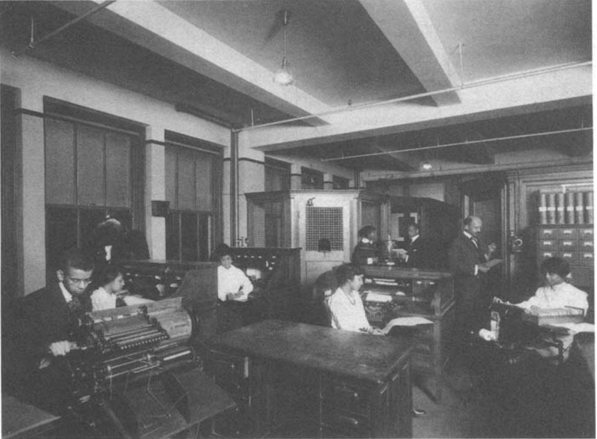

# Dare You Fight
## The Du Bois Editorials in The Crisis


This is an ongoing project to make available some of the editorials published by The Crisis, the official journal of the NAACP, between 1910 and 1934, when it was edited by W. E. B. Du Bois. 



```{tableofcontents}
```
